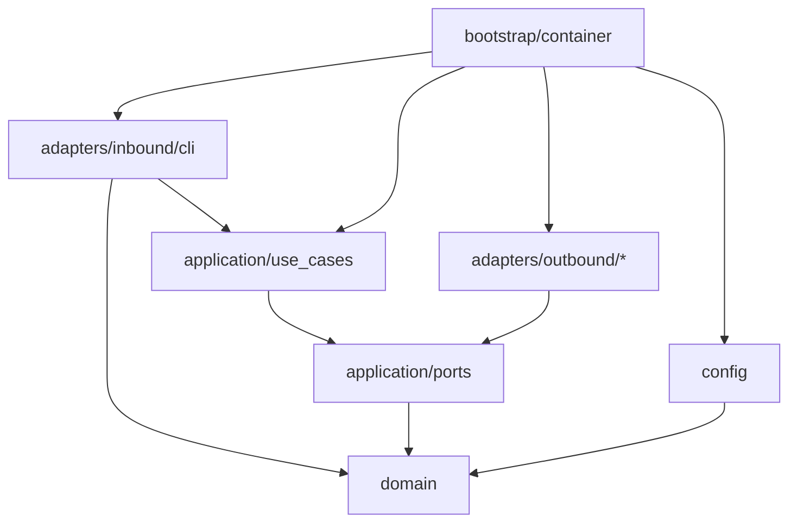

# Hexagonal Refactor + Rich Live Progress — Implementation Plan

> **For agentic workers:** REQUIRED SUB-SKILL: Use superpowers:subagent-driven-development (recommended) or superpowers:executing-plans to implement this plan task-by-task. Steps use checkbox (`- [ ]`) syntax for tracking.

> **Status:** Validado em 2026-09-01 (Claude) sobre o rascunho do Cursor. Decisões e correções em §Decisões.
> **Base:** commit `a954aad` (main). Branch: `refactor/hexagonal-architecture`.

**Goal:** Reestruturar o `yt-downloader` em ports & adapters reais (domain → application → adapters), com provider YouTube swappável, conversão via ffmpeg, progresso Rich ao vivo, toolchain `uv + ruff(ALL) + pyright` — mantendo os comandos e flags da CLI.

**Architecture:** Domain puro (modelos frozen + parser de URL + erros). Application = 4 portas outbound (`Protocol`) + 2 use cases (`DownloadMediaUseCase`, `DownloadPlaylistUseCase`). Adapters outbound (pytubefix, ffmpeg, filesystem local, Rich) e inbound (Typer). `bootstrap/container.py` é o único lugar que conhece classes concretas. Use cases só conhecem `DomainError`; cada adapter traduz exceção de vendor no boundary.

**Tech Stack:** Python 3.13 (uv), pytubefix, typer, rich, pydantic-settings, ffmpeg (binário externo, já era exigido pelo pydub), pytest + pytest-asyncio, ruff, pyright.

**Spec:** este documento (§Decisões + §Contratos). Não há spec separada.

## Global Constraints

- `requires-python = ">=3.12"`; `.python-version` = `3.13` (o que o uv já escolhe nesta máquina).
- **Sem `pydub`** (importa `audioop`, removido no 3.13 — PEP 594; lib sem release desde 2021). Conversão = `ffmpeg` via `subprocess`.
- **Sem `yt-dlp`** — nem dep, nem stub. Porta + registry já são o ponto de extensão.
- Dev deps em `[dependency-groups] dev` (PEP 735) — `uv run` instala por padrão; `[project.optional-dependencies].dev` **não** instala e é por isso que `uv run pytest` falha hoje.
- Ruff `select = ["ALL"]` com ignores documentados; pyright `strict` em `src/`. Pipeline antes de qualquer commit: `uv run ruff format . && uv run ruff check --fix . && uv run pyright && uv run pytest`.
- Testes em `tests/` na raiz (fora do pacote). `asyncio_mode = "auto"`. Fixture custom `event_loop` **removida** (não existe mais no pytest-asyncio 1.x).
- Nada fora de `bootstrap/`, `config/` e `adapters/inbound/cli/` importa `Settings`.
- Zero import de `pytubefix` fora de `adapters/outbound/youtube/`; zero `subprocess` fora de `adapters/outbound/audio/`.
- Sem `Any`. Sem `type: ignore` sem justificativa na mesma linha.
- Commits: Conventional Commits, um por task, **sem trailer Co-Authored-By nem qualquer menção a Claude/IA na mensagem**. Squash em 2 commits (Fase A / Fase B) é decisão do Eduardo no PR. **Push só o Eduardo.**
- CLI mantém `download-video`, `download-playlist`, `info` e todas as flags (`-o -r --audio-only --mp3/--no-mp3 -b --batch-size --async/--no-async --debug`).

---

## Decisões (diferenças em relação ao rascunho do Cursor)

| # | Rascunho | Decisão validada | Por quê |
|---|---|---|---|
| 1 | `pydub >=0.25.1` "última estável" | **Adapter `FfmpegConverter` via subprocess; pydub removido** | pydub quebra no 3.13 (`audioop`); suíte está com 0 testes rodando hoje. pydub só embrulhava o ffmpeg. |
| 2 | `YouTubeProviderPort` com `get_*_stream() -> StreamInfo` + `download_stream(StreamInfo)` | **Porta grossa:** `fetch_playlist`, `download_audio`, `download_video` | `StreamInfo` frozen não carrega o `Stream` do pytubefix → adapter refaria o fetch (2 requests/vídeo). yt-dlp também não trabalha por itag. |
| 3 | `DownloadRequest(kind, resolution, convert_to_mp3, bitrate)` | **Tipo-soma** `media: VideoDownload(resolution) \| AudioDownload(mp3_bitrate: Bitrate \| None)` | O rascunho tornava representável `kind="audio"+resolution` e `convert=False+bitrate`. |
| 4 | `async_mode: bool` + `batch_size: int` | **`concurrency: int`** (1 = sequencial). `--no-async` → 1, `--batch-size N` → N | Um knob em vez de dois; elimina `async=False, batch=10`. Semáforo substitui lotes sequenciais (mesmo throughput). |
| 5 | 4 use cases (video, audio, playlist, inspect) | **2 use cases:** `DownloadMediaUseCase` (branch no tipo-soma) + `DownloadPlaylistUseCase` | `InspectUrl` sem porta = camada fantasma (mesmo smell de `commands/`); CLI chama `domain.url_parser` direto. Video/audio separados duplicariam o discriminador na CLI. |
| 6 | `ProgressReporterPort` com `start/stop`, `add_task(task_id) -> str`, `level: str` | `start/stop` **fora** da porta dos use cases (`ProgressSessionPort` = porta + context manager, usada só por bootstrap/CLI); `add_task(desc) -> TaskId`; `level: Literal[...]` | ISP: use case não gerencia display. Id gerado pela porta. Sem tipo frouxo. |
| 7 | Hook de progresso único no provider | **Closure por download** (`on_progress` é parâmetro de `download_*`) | Com N downloads concorrentes em threads, callback compartilhado não sabe de qual task é o chunk. |
| 8 | Commit 1 com fachada temporária em `services/downloader.py` | **Sem fachada.** Fase A não toca `services/`; Fase B substitui e deleta | Nenhum teste importa `YouTubeDownloader`; único consumidor é `commands/`, que morre na Fase B. |
| 9 | Tabela de versões (`pytubefix>=8`, `rich>=13.9`…) | **`uv lock --upgrade`, testar, floor = versão resolvida** | Tabela estava abaixo do lock atual (pytubefix 9.5, rich 14.1, typer 0.19, pytest-asyncio 1.2). Upgrade resolve pytubefix 10.11 (puxa `nodejs-wheel-binaries`), rich 15, typer 0.27, pytest 9. |
| 10 | Stub `yt_dlp/provider.py` com `NotImplementedError` | **Não criar** | YAGNI. |
| 11 | Cobertura 50% "se der" | **Medir após Fase B; gate = medido − 5** | Número antes da medição induz padding. |
| 12 | `ports/outbound/` | `application/ports/` | Não há portas inbound; nível de diretório redundante. |
| 13 | — | Remover `DownloadSettings.audio_bitrate` (duplicado morto; código lê `audio.default_bitrate`) e `DownloadSettings.timeout` (nunca lido) | SSoT. |
| 14 | — | Adapters recebem primitivos (`ffmpeg_path: str`), não `Settings` | Adapter não depende do schema de config. |
| 15 | Falha de conversão: sync mantinha original e avisava; async levantava | **Sempre `ConversionFailedError`**, original **mantido** no disco. Playlist coleta como `DownloadFailure` | Fail-fast, comportamento único. |

**Comportamento externo que muda (documentar no CHANGELOG):** (a) falha de conversão vira erro em vez de warning silencioso no modo single; (b) `download-playlist` sai com código 1 se **nenhum** vídeo baixou (antes só em exceção); (c) `-r/--resolution` valida `lowest|highest` no parse (antes qualquer string caía em `highest`).

---

## Arquitetura alvo

```
src/yt_downloader/
├── domain/
│   ├── __init__.py
│   ├── errors.py            # DomainError e subclasses
│   ├── models.py            # Resolution, Bitrate, refs, MediaSpec, requests, results
│   └── url_parser.py        # parse_youtube_url / parse_video_url / parse_playlist_url
├── application/
│   ├── __init__.py
│   ├── ports/
│   │   ├── __init__.py
│   │   ├── audio_converter.py     # AudioConverterPort
│   │   ├── filesystem.py          # FilesystemPort
│   │   ├── progress_reporter.py   # ProgressReporterPort, ProgressSessionPort, TaskId, LogLevel
│   │   └── youtube_provider.py    # YouTubeProviderPort, ProgressCallback
│   └── use_cases/
│       ├── __init__.py
│       ├── download_media.py      # DownloadMediaUseCase
│       └── download_playlist.py   # DownloadPlaylistUseCase
├── adapters/
│   ├── __init__.py
│   ├── inbound/
│   │   ├── __init__.py
│   │   └── cli/
│   │       ├── __init__.py
│   │       ├── app.py             # Typer skinny
│   │       ├── presenters.py      # saída Rich (sucesso/erro/resumo)
│   │       └── logging_setup.py   # RichHandler no mesmo Console
│   └── outbound/
│       ├── __init__.py
│       ├── audio/
│       │   ├── __init__.py
│       │   └── ffmpeg_converter.py
│       ├── filesystem/
│       │   ├── __init__.py
│       │   └── local.py
│       ├── progress/
│       │   ├── __init__.py
│       │   └── rich_reporter.py
│       └── youtube/
│           ├── __init__.py
│           ├── pytubefix_provider.py
│           └── registry.py        # build_youtube_provider(YouTubeSettings)
├── bootstrap/
│   ├── __init__.py
│   └── container.py               # composition root
├── config/
│   ├── __init__.py
│   └── settings.py                # + YouTubeSettings; − audio_bitrate, timeout
├── __init__.py
├── main.py                        # thin: re-exporta app
└── py.typed

tests/
├── __init__.py
├── conftest.py
├── fakes.py                       # fakes das 4 portas (usados por use cases e CLI)
├── test_config.py
├── test_domain_models.py
├── test_url_parser.py
├── test_local_filesystem.py
├── test_ffmpeg_converter.py
├── test_rich_reporter.py
├── test_pytubefix_provider.py
├── test_registry.py
├── test_download_media.py
├── test_download_playlist.py
├── test_container.py
└── test_cli.py
```

**Deletados na Fase B:** `src/yt_downloader/{audio,commands,services}/`, `src/yt_downloader/tests/`, `src/__init__.py` (esse já na Task 1).

### Regra de dependências



Seta = "pode importar". `domain` não importa nada do pacote. `config` só importa `domain` (pelo enum `Resolution`).

---

## Contratos (fonte única — as tasks copiam daqui)

```python
# domain/models.py
class Resolution(StrEnum): LOWEST = "lowest"; HIGHEST = "highest"
@dataclass(frozen=True, slots=True) class Bitrate: value: str            # valida r"^\d{2,3}k$"
@dataclass(frozen=True, slots=True) class VideoRef: id: str; url: str
@dataclass(frozen=True, slots=True) class PlaylistRef: id: str; url: str
@dataclass(frozen=True, slots=True) class VideoDownload: resolution: Resolution
@dataclass(frozen=True, slots=True) class AudioDownload: mp3_bitrate: Bitrate | None   # None = manter original
MediaSpec = VideoDownload | AudioDownload
@dataclass(frozen=True, slots=True) class DownloadRequest: target: VideoRef; media: MediaSpec; output_dir: Path
@dataclass(frozen=True, slots=True) class PlaylistDownloadRequest: target: PlaylistRef; media: MediaSpec; output_dir: Path; concurrency: int  # >= 1
@dataclass(frozen=True, slots=True) class DownloadedFile: path: Path; title: str
@dataclass(frozen=True, slots=True) class PlaylistInfo: ref: PlaylistRef; title: str; videos: tuple[VideoRef, ...]
@dataclass(frozen=True, slots=True) class DownloadFailure: target: VideoRef; reason: str
@dataclass(frozen=True, slots=True) class BatchDownloadResult: successes: tuple[DownloadedFile, ...]; failures: tuple[DownloadFailure, ...]

# domain/errors.py
DomainError(Exception) ← InvalidUrlError, InvalidBitrateError, InvalidConcurrencyError,
                          EmptyPlaylistError, StreamUnavailableError, ConversionFailedError, ProviderError

# domain/url_parser.py
def parse_youtube_url(url: str) -> VideoRef | PlaylistRef   # playlist vence se houver list=PL…
def parse_video_url(url: str) -> VideoRef
def parse_playlist_url(url: str) -> PlaylistRef

# application/ports
ProgressCallback = Callable[[int, int], None]                  # (bytes_done, bytes_total)
class YouTubeProviderPort(Protocol):
    def fetch_playlist(self, ref: PlaylistRef) -> PlaylistInfo: ...
    def download_audio(self, ref: VideoRef, dest_dir: Path, on_progress: ProgressCallback) -> DownloadedFile: ...
    def download_video(self, ref: VideoRef, resolution: Resolution, dest_dir: Path, on_progress: ProgressCallback) -> DownloadedFile: ...
class AudioConverterPort(Protocol):
    def to_mp3(self, source: Path, dest_dir: Path, bitrate: Bitrate) -> Path: ...
class FilesystemPort(Protocol):
    def ensure_dir(self, path: Path) -> Path: ...                 # devolve resolvido
    def delete(self, path: Path) -> None: ...
LogLevel = Literal["info", "warn", "error"]; TaskId = NewType("TaskId", int)
class ProgressReporterPort(Protocol):
    def add_task(self, description: str, *, total: int | None = None) -> TaskId: ...
    def update(self, task: TaskId, *, advance: int = 0, completed: int | None = None, total: int | None = None, description: str | None = None) -> None: ...
    def complete(self, task: TaskId) -> None: ...
    def log(self, message: str, *, level: LogLevel = "info") -> None: ...
class ProgressSessionPort(ProgressReporterPort, Protocol):     # só bootstrap/CLI
    def __enter__(self) -> Self: ...
    def __exit__(self, *exc: object) -> None: ...

# application/use_cases
class DownloadMediaUseCase:      def execute(self, request: DownloadRequest) -> DownloadedFile
class DownloadPlaylistUseCase:   async def execute(self, request: PlaylistDownloadRequest) -> BatchDownloadResult

# bootstrap/container.py
@dataclass(frozen=True, slots=True) class Container: settings: Settings; console: Console; progress: ProgressSessionPort; download_media: DownloadMediaUseCase; download_playlist: DownloadPlaylistUseCase
def build_container(settings: Settings, console: Console) -> Container
```

---

# Fase A — tornar a mudança fácil (não toca `services/`, `commands/`, `audio/`, `main.py`)

> Durante a Fase A a CLI antiga fica exatamente como está hoje: **quebrada no 3.13** (pydub). Ela é substituída na Task 13. Legado fica excluído de ruff/pyright até lá (exclusão removida na Task 13).

### Task 1: Toolchain, harness de testes e upgrade de deps

**Files:**
- Modify: `pyproject.toml`
- Create: `.python-version`, `tests/__init__.py`, `tests/conftest.py`
- Move: `src/yt_downloader/tests/test_config.py` → `tests/test_config.py`; `src/yt_downloader/tests/test_parser.py` → `tests/test_parser.py` (temporário; Task 3 substitui)
- Delete: `src/yt_downloader/tests/test_audio_converter.py`, `src/yt_downloader/tests/conftest.py`, `src/yt_downloader/tests/__init__.py`, `src/__init__.py`
- Modify: `src/yt_downloader/services/__init__.py`, `src/yt_downloader/commands/video.py:7`, `src/yt_downloader/commands/playlist.py:7`, `src/yt_downloader/main.py:22`

**Interfaces:** Produces: comandos `uv run pytest`, `uv run ruff check .`, `uv run pyright` verdes; `tests/` como raiz de testes.

- [ ] **Step 1: Reescrever `pyproject.toml`**

```toml
[project]
name = "yt-downloader"
version = "0.1.0"
description = "A modern YouTube downloader CLI with async support"
readme = "README.md"
license = { text = "MIT" }
authors = [{ name = "Eduardo Jesus", email = "dudulj15@gmail.com" }]
maintainers = [{ name = "Eduardo Jesus", email = "dudulj15@gmail.com" }]
keywords = ["youtube", "downloader", "cli", "async", "pydantic", "typer"]
classifiers = [
    "Development Status :: 3 - Alpha",
    "Intended Audience :: Developers",
    "License :: OSI Approved :: MIT License",
    "Operating System :: OS Independent",
    "Programming Language :: Python :: 3",
    "Programming Language :: Python :: 3.12",
    "Programming Language :: Python :: 3.13",
    "Topic :: Multimedia :: Video",
    "Topic :: Utilities",
]
requires-python = ">=3.12"
# Floors = versões resolvidas por `uv lock --upgrade` em 2026-09-01. Ajustar se o Step 4 mostrar outra.
dependencies = [
    "pytubefix>=10.11.0",
    "typer>=0.27.0",
    "rich>=15.0.0",
    "pydantic>=2.13.0",
    "pydantic-settings>=2.15.0",
]

[dependency-groups]
dev = [
    "pytest>=9.1.0",
    "pytest-cov>=7.1.0",
    "pytest-asyncio>=1.4.0",
    "ruff>=0.14.0",
    "pyright>=1.1.400",
]
docs = ["mkdocs>=1.5.0", "mkdocs-material>=9.0.0"]

[project.scripts]
yt-downloader = "yt_downloader.main:app"

[project.urls]
Homepage = "https://github.com/eduardojesus12/yt-downloader"
Repository = "https://github.com/eduardojesus12/yt-downloader"
Issues = "https://github.com/eduardojesus12/yt-downloader/issues"
Changelog = "https://github.com/eduardojesus12/yt-downloader/blob/main/CHANGELOG.md"
Documentation = "https://eduardojesus12.github.io/yt-downloader/"

[build-system]
requires = ["uv_build>=0.8.15,<0.9.0"]
build-backend = "uv_build"

[tool.pytest.ini_options]
testpaths = ["tests"]
asyncio_mode = "auto"
markers = ["integration: hits the network or needs a real ffmpeg; skipped by default"]
addopts = [
    "--cov=yt_downloader",
    "--cov-report=term-missing",
    "--cov-fail-under=0",   # gate real definido na Task 14 após medição
    "-m", "not integration",
]

[tool.ruff]
line-length = 100
target-version = "py312"
# Legado removido na Task 13 — não adicionar nada aqui.
extend-exclude = [
    "src/yt_downloader/audio",
    "src/yt_downloader/commands",
    "src/yt_downloader/services",
    "src/yt_downloader/main.py",
]

[tool.ruff.lint]
select = ["ALL"]
ignore = [
    "D203", "D213",   # conflitam com D211/D212 (convenção google)
    "COM812", "ISC001", # conflitam com o formatter
    "TRY003", "EM101", "EM102", # mensagem inline em `raise X(f"...")` — erros de domínio pequenos não justificam classe por mensagem
]

[tool.ruff.lint.pydocstyle]
convention = "google"

[tool.ruff.lint.per-file-ignores]
"tests/**" = ["S101", "D", "ANN", "PLR2004", "SLF001", "ARG", "FBT"]
"src/yt_downloader/adapters/outbound/**" = ["BLE001"]  # anti-corruption: adapter captura Exception do vendor e traduz em ProviderError
"src/yt_downloader/adapters/outbound/audio/ffmpeg_converter.py" = ["S603", "S607"]  # subprocess com argv fixo, sem shell
"src/yt_downloader/adapters/inbound/cli/app.py" = ["FBT001", "FBT002", "PLR0913"]  # assinatura ditada pelo Typer

[tool.pyright]
include = ["src", "tests"]
exclude = [
    "src/yt_downloader/audio",
    "src/yt_downloader/commands",
    "src/yt_downloader/services",
    "src/yt_downloader/main.py",
]
pythonVersion = "3.12"
typeCheckingMode = "strict"
venvPath = "."
venv = ".venv"
```

- [ ] **Step 2: `.python-version`, `tests/`, mover testes, apagar `src/__init__.py`**

```bash
cd d:/Projects/yt-downloader
git checkout -b refactor/hexagonal-architecture
printf '3.13\n' > .python-version
mkdir -p tests
printf '"""Test suite (root level, outside the package)."""\n' > tests/__init__.py
printf '"""Shared pytest configuration. asyncio_mode=auto lives in pyproject."""\n' > tests/conftest.py
git mv src/yt_downloader/tests/test_config.py tests/test_config.py
git mv src/yt_downloader/tests/test_parser.py tests/test_parser.py
git rm -q src/yt_downloader/tests/test_audio_converter.py src/yt_downloader/tests/conftest.py src/yt_downloader/tests/__init__.py src/__init__.py
```

- [ ] **Step 3: Quebrar a cadeia de import eager que puxa pydub**

`src/yt_downloader/services/__init__.py` inteiro:
```python
"""Legacy services package (replaced in Task 13)."""

from .parser import URLParser

__all__ = ["URLParser"]
```
Em `commands/video.py:7` e `commands/playlist.py:7`: `from ..services import YouTubeDownloader` → `from ..services.downloader import YouTubeDownloader`.
Em `main.py:22`: `from .services import URLParser` → `from .services.parser import URLParser`.

- [ ] **Step 4: Upgrade e sync**

Run: `uv lock --upgrade && uv sync`
Expected: resolve `pytubefix 10.11.x`, `rich 15.x`, `typer 0.27.x`, `pytest 9.x`, `pytest-asyncio 1.4.x`, sem `pydub`. Se alguma versão resolvida for menor que o floor no `pyproject`, abaixar o floor para a resolvida (o floor documenta a realidade, não um desejo).

- [ ] **Step 5: Rodar o gate**

Run: `uv run pytest -q`
Expected: `tests/test_config.py` e `tests/test_parser.py` coletam e passam (parser importa `yt_downloader.services.parser` sem tocar pydub). 0 erros de coleção.

Run: `uv run ruff format . && uv run ruff check . && uv run pyright`
Expected: ruff só formata `config/` e `tests/`; violações remanescentes em `tests/test_parser.py` são aceitáveis (arquivo morre na Task 3) — se houver, adicionar `# noqa` **não**; em vez disso adicionar `"tests/test_parser.py" = ["ALL"]` em per-file-ignores com o comentário `# legado, removido na Task 3`. Pyright: 0 erros em `config/` e `tests/`.

- [ ] **Step 6: Commit**

```bash
git add -A
git commit -m "build: uv dependency groups, ruff(ALL)+pyright, root tests/, drop pydub

pydub imports audioop (removed in Python 3.13) and has no release since
2021; conversion moves to an ffmpeg adapter in a later commit. Dev deps
move to PEP 735 groups so 'uv run pytest' actually installs pytest.

```

---

### Task 2: Domain — erros e modelos

**Files:**
- Create: `src/yt_downloader/domain/__init__.py`, `src/yt_downloader/domain/errors.py`, `src/yt_downloader/domain/models.py`
- Test: `tests/test_domain_models.py`

**Interfaces:** Produces: tudo em §Contratos → `domain/models.py` e `domain/errors.py`.

- [ ] **Step 1: Teste que falha**

`tests/test_domain_models.py`:
```python
from pathlib import Path

import pytest

from yt_downloader.domain.errors import InvalidBitrateError, InvalidConcurrencyError
from yt_downloader.domain.models import (
    AudioDownload,
    Bitrate,
    PlaylistDownloadRequest,
    PlaylistRef,
    Resolution,
    VideoDownload,
)


@pytest.mark.parametrize("value", ["64k", "128k", "320k"])
def test_bitrate_accepts_kbps_strings(value: str) -> None:
    assert str(Bitrate(value)) == value


@pytest.mark.parametrize("value", ["", "128", "128K", "1k", "1024k", "128kbps", "abc"])
def test_bitrate_rejects_other_strings(value: str) -> None:
    with pytest.raises(InvalidBitrateError):
        Bitrate(value)


def test_bitrate_is_immutable() -> None:
    bitrate = Bitrate("128k")
    with pytest.raises(AttributeError):
        bitrate.value = "192k"  # type: ignore[misc]  # testing frozen dataclass


def test_resolution_values_match_cli_strings() -> None:
    assert Resolution("lowest") is Resolution.LOWEST
    assert Resolution("highest") is Resolution.HIGHEST


def test_media_spec_variants_are_distinct_types() -> None:
    video = VideoDownload(resolution=Resolution.LOWEST)
    audio = AudioDownload(mp3_bitrate=None)
    assert not isinstance(video, AudioDownload)
    assert audio.mp3_bitrate is None


def test_playlist_request_rejects_concurrency_below_one() -> None:
    ref = PlaylistRef(id="PLabc", url="https://www.youtube.com/playlist?list=PLabc")
    with pytest.raises(InvalidConcurrencyError):
        PlaylistDownloadRequest(
            target=ref, media=AudioDownload(mp3_bitrate=None), output_dir=Path("x"), concurrency=0
        )
```

- [ ] **Step 2: Rodar — deve falhar**

Run: `uv run pytest tests/test_domain_models.py -q`
Expected: `ModuleNotFoundError: No module named 'yt_downloader.domain'`

- [ ] **Step 3: Implementar**

`src/yt_downloader/domain/__init__.py`:
```python
"""Pure domain: models, errors and URL parsing. No runtime dependencies."""
```

`src/yt_downloader/domain/errors.py`:
```python
"""Domain errors. The application layer only ever catches DomainError."""


class DomainError(Exception):
    """Base class for every error the application layer knows about."""


class InvalidUrlError(DomainError):
    """URL is not a YouTube video or playlist URL."""


class InvalidBitrateError(DomainError):
    """Bitrate string is not of the form '<digits>k'."""


class InvalidConcurrencyError(DomainError):
    """Concurrency must be at least 1."""


class EmptyPlaylistError(DomainError):
    """Playlist resolved but contains no videos."""


class StreamUnavailableError(DomainError):
    """Provider found the video but no stream matches the request."""


class ConversionFailedError(DomainError):
    """Audio conversion failed; the original file is left on disk."""


class ProviderError(DomainError):
    """Vendor failure translated at the adapter boundary."""
```

`src/yt_downloader/domain/models.py`:
```python
"""Domain value objects and request/result types.

Every type is frozen. Illegal combinations (audio + resolution, no-mp3 +
bitrate) are unrepresentable via the MediaSpec sum type.
"""

import re
from dataclasses import dataclass
from enum import StrEnum
from pathlib import Path

from .errors import InvalidBitrateError, InvalidConcurrencyError


class Resolution(StrEnum):
    """Video resolution selector. Values double as CLI choices."""

    LOWEST = "lowest"
    HIGHEST = "highest"


_BITRATE_RE = re.compile(r"^\d{2,3}k$")


@dataclass(frozen=True, slots=True)
class Bitrate:
    """MP3 bitrate such as '128k'."""

    value: str

    def __post_init__(self) -> None:
        if not _BITRATE_RE.fullmatch(self.value):
            raise InvalidBitrateError(f"Invalid bitrate {self.value!r}; expected e.g. '128k'")

    def __str__(self) -> str:
        return self.value


@dataclass(frozen=True, slots=True)
class VideoRef:
    """A single YouTube video (11-char id) and the URL it was parsed from."""

    id: str
    url: str


@dataclass(frozen=True, slots=True)
class PlaylistRef:
    """A YouTube playlist (PL… id) and the URL it was parsed from."""

    id: str
    url: str


@dataclass(frozen=True, slots=True)
class VideoDownload:
    """Download the video stream at the given resolution."""

    resolution: Resolution


@dataclass(frozen=True, slots=True)
class AudioDownload:
    """Download the audio-only stream; convert to MP3 when a bitrate is given."""

    mp3_bitrate: Bitrate | None


MediaSpec = VideoDownload | AudioDownload


@dataclass(frozen=True, slots=True)
class DownloadRequest:
    """Download one video according to a MediaSpec."""

    target: VideoRef
    media: MediaSpec
    output_dir: Path


@dataclass(frozen=True, slots=True)
class PlaylistDownloadRequest:
    """Download every video of a playlist; concurrency=1 means sequential."""

    target: PlaylistRef
    media: MediaSpec
    output_dir: Path
    concurrency: int

    def __post_init__(self) -> None:
        if self.concurrency < 1:
            raise InvalidConcurrencyError(f"Concurrency must be >= 1, got {self.concurrency}")


@dataclass(frozen=True, slots=True)
class DownloadedFile:
    """A file that landed on disk, plus the video title for display."""

    path: Path
    title: str


@dataclass(frozen=True, slots=True)
class PlaylistInfo:
    """Resolved playlist metadata."""

    ref: PlaylistRef
    title: str
    videos: tuple[VideoRef, ...]


@dataclass(frozen=True, slots=True)
class DownloadFailure:
    """One video of a batch that failed, with the domain error message."""

    target: VideoRef
    reason: str


@dataclass(frozen=True, slots=True)
class BatchDownloadResult:
    """Outcome of a playlist download; order follows the playlist."""

    successes: tuple[DownloadedFile, ...]
    failures: tuple[DownloadFailure, ...]
```

- [ ] **Step 4: Rodar — deve passar**

Run: `uv run pytest tests/test_domain_models.py -q && uv run ruff format . && uv run ruff check . && uv run pyright`
Expected: 6 passed (parametrizados contam mais); ruff/pyright 0 erros.

- [ ] **Step 5: Commit**

```bash
git add src/yt_downloader/domain tests/test_domain_models.py
git commit -m "feat(domain): frozen models, MediaSpec sum type and domain errors

```

---

### Task 3: Domain — parser de URL

**Files:**
- Create: `src/yt_downloader/domain/url_parser.py`
- Create: `tests/test_url_parser.py`
- Delete: `tests/test_parser.py` (e a per-file-ignore dele no pyproject, se foi adicionada na Task 1)

**Interfaces:** Consumes: `VideoRef`, `PlaylistRef`, `InvalidUrlError`. Produces: `parse_youtube_url`, `parse_video_url`, `parse_playlist_url` (assinaturas em §Contratos).

- [ ] **Step 1: Teste que falha** (porta os casos de `test_parser.py`)

`tests/test_url_parser.py`:
```python
import pytest

from yt_downloader.domain.errors import InvalidUrlError
from yt_downloader.domain.models import PlaylistRef, VideoRef
from yt_downloader.domain.url_parser import (
    parse_playlist_url,
    parse_video_url,
    parse_youtube_url,
)

VIDEO_ID = "dQw4w9WgXcQ"
PLAYLIST_ID = "PLrAXtmRdnEQy4qtr5mYJ2hBJc5VcWKvLk"


@pytest.mark.parametrize(
    "url",
    [
        f"https://www.youtube.com/watch?v={VIDEO_ID}",
        f"https://youtu.be/{VIDEO_ID}",
        f"https://youtube.com/watch?v={VIDEO_ID}",
        f"https://www.youtube.com/watch?v={VIDEO_ID}&t=30",
        f"https://youtu.be/{VIDEO_ID}?t=30",
        f"https://www.youtube.com/embed/{VIDEO_ID}",
        f"www.youtube.com/watch?v={VIDEO_ID}",
    ],
)
def test_parses_video_urls(url: str) -> None:
    ref = parse_youtube_url(url)
    assert ref == VideoRef(id=VIDEO_ID, url=url)


@pytest.mark.parametrize(
    "url",
    [
        f"https://www.youtube.com/playlist?list={PLAYLIST_ID}",
        f"https://youtube.com/playlist?list={PLAYLIST_ID}",
        f"https://www.youtube.com/watch?v={VIDEO_ID}&list={PLAYLIST_ID}",  # playlist wins
    ],
)
def test_parses_playlist_urls(url: str) -> None:
    ref = parse_youtube_url(url)
    assert ref == PlaylistRef(id=PLAYLIST_ID, url=url)


@pytest.mark.parametrize(
    "url",
    [
        "",
        "not a url",
        "https://www.google.com",
        "https://vimeo.com/123456",
        "https://youtube.com/playlist",
        "https://www.youtube.com/playlist?list=NOTAPLAYLIST",
        "https://www.youtube.com/watch?v=short",
    ],
)
def test_rejects_non_youtube_urls(url: str) -> None:
    with pytest.raises(InvalidUrlError):
        parse_youtube_url(url)


def test_parse_video_url_rejects_playlist() -> None:
    with pytest.raises(InvalidUrlError):
        parse_video_url(f"https://www.youtube.com/playlist?list={PLAYLIST_ID}")


def test_parse_playlist_url_rejects_video() -> None:
    with pytest.raises(InvalidUrlError):
        parse_playlist_url(f"https://youtu.be/{VIDEO_ID}")
```

- [ ] **Step 2: Rodar — deve falhar**

Run: `uv run pytest tests/test_url_parser.py -q`
Expected: `ModuleNotFoundError: ... url_parser`

- [ ] **Step 3: Implementar**

`src/yt_downloader/domain/url_parser.py`:
```python
"""Parse YouTube URLs into VideoRef / PlaylistRef. Playlist wins when both are present."""

import re
from urllib.parse import parse_qs, urlparse

from .errors import InvalidUrlError
from .models import PlaylistRef, VideoRef

_DOMAIN_RE = re.compile(r"^(?:https?://)?(?:www\.)?(?:youtube\.com|youtu\.be)", re.IGNORECASE)
_PLAYLIST_ID_RE = re.compile(r"^PL[a-zA-Z0-9_-]+$")
_VIDEO_ID_PATTERNS = (
    re.compile(r"(?:https?://)?(?:www\.)?youtube\.com/watch\?v=([a-zA-Z0-9_-]{11})"),
    re.compile(r"(?:https?://)?youtu\.be/([a-zA-Z0-9_-]{11})"),
    re.compile(r"(?:https?://)?(?:www\.)?youtube\.com/embed/([a-zA-Z0-9_-]{11})"),
)


def parse_youtube_url(url: str) -> VideoRef | PlaylistRef:
    """Return a PlaylistRef if the URL carries a playlist id, else a VideoRef.

    Raises:
        InvalidUrlError: not a YouTube domain, or neither id could be extracted.
    """
    if not _DOMAIN_RE.match(url):
        raise InvalidUrlError(f"Not a YouTube URL: {url!r}")
    playlist_id = _extract_playlist_id(url)
    if playlist_id is not None:
        return PlaylistRef(id=playlist_id, url=url)
    video_id = _extract_video_id(url)
    if video_id is not None:
        return VideoRef(id=video_id, url=url)
    raise InvalidUrlError(f"No video or playlist id found in: {url!r}")


def parse_video_url(url: str) -> VideoRef:
    """Parse a URL that must be a single video."""
    ref = parse_youtube_url(url)
    if not isinstance(ref, VideoRef):
        raise InvalidUrlError(f"Expected a video URL, got a playlist: {url!r}")
    return ref


def parse_playlist_url(url: str) -> PlaylistRef:
    """Parse a URL that must be a playlist."""
    ref = parse_youtube_url(url)
    if not isinstance(ref, PlaylistRef):
        raise InvalidUrlError(f"Expected a playlist URL, got a video: {url!r}")
    return ref


def _extract_playlist_id(url: str) -> str | None:
    values = parse_qs(urlparse(url).query).get("list")
    if not values:
        return None
    candidate = values[0]
    return candidate if _PLAYLIST_ID_RE.match(candidate) else None


def _extract_video_id(url: str) -> str | None:
    for pattern in _VIDEO_ID_PATTERNS:
        match = pattern.search(url)
        if match:
            return match.group(1)
    return None
```

- [ ] **Step 4: Apagar o teste legado e rodar**

```bash
git rm -q tests/test_parser.py
```
Remover a linha `"tests/test_parser.py" = ["ALL"]` do pyproject se existir.

Run: `uv run pytest tests/test_url_parser.py -q && uv run ruff format . && uv run ruff check . && uv run pyright`
Expected: todos passam; 0 erros.

- [ ] **Step 5: Commit**

```bash
git add -A
git commit -m "feat(domain): url parser returning VideoRef | PlaylistRef

Replaces services/parser.URLParser (deleted in a later commit) and its
tests; same accepted/rejected URL set, playlist still wins over video.

```

---

### Task 4: Portas + fakes

**Files:**
- Create: `src/yt_downloader/application/__init__.py`, `src/yt_downloader/application/ports/__init__.py`, `.../ports/youtube_provider.py`, `.../ports/audio_converter.py`, `.../ports/filesystem.py`, `.../ports/progress_reporter.py`
- Create: `tests/fakes.py`

**Interfaces:** Produces: as 5 `Protocol`s de §Contratos e os fakes `FakeYouTubeProvider`, `FakeAudioConverter`, `FakeFilesystem`, `RecordingProgress` (usados nas Tasks 10, 11, 13).

- [ ] **Step 1: Escrever os fakes primeiro (são o "teste" das portas — pyright verifica que satisfazem os Protocols)**

`tests/fakes.py`:
```python
"""In-memory fakes for the four outbound ports. Structural typing = the contract test."""

import threading
import time
from dataclasses import dataclass, field
from pathlib import Path
from typing import Self

from yt_downloader.application.ports.audio_converter import AudioConverterPort
from yt_downloader.application.ports.filesystem import FilesystemPort
from yt_downloader.application.ports.progress_reporter import (
    LogLevel,
    ProgressSessionPort,
    TaskId,
)
from yt_downloader.application.ports.youtube_provider import ProgressCallback, YouTubeProviderPort
from yt_downloader.domain.errors import (
    ConversionFailedError,
    ProviderError,
    StreamUnavailableError,
)
from yt_downloader.domain.models import (
    Bitrate,
    DownloadedFile,
    PlaylistInfo,
    PlaylistRef,
    Resolution,
    VideoRef,
)


@dataclass
class FakeYouTubeProvider:
    """Writes a 5-byte file per download; tracks calls and peak concurrency."""

    playlist: PlaylistInfo | None = None
    fail_ids: frozenset[str] = frozenset()
    total_bytes: int = 100
    work_seconds: float = 0.0
    calls: list[tuple[str, str]] = field(default_factory=list)
    peak_concurrency: int = 0
    _active: int = 0
    _lock: threading.Lock = field(default_factory=threading.Lock)

    def fetch_playlist(self, ref: PlaylistRef) -> PlaylistInfo:
        if self.playlist is None:
            raise ProviderError(f"fake: no playlist for {ref.id}")
        return self.playlist

    def download_audio(
        self, ref: VideoRef, dest_dir: Path, on_progress: ProgressCallback
    ) -> DownloadedFile:
        return self._download("audio", ref, dest_dir, ".m4a", on_progress)

    def download_video(
        self, ref: VideoRef, resolution: Resolution, dest_dir: Path, on_progress: ProgressCallback
    ) -> DownloadedFile:
        return self._download(f"video:{resolution}", ref, dest_dir, ".mp4", on_progress)

    def _download(
        self, kind: str, ref: VideoRef, dest_dir: Path, suffix: str, on_progress: ProgressCallback
    ) -> DownloadedFile:
        with self._lock:
            self.calls.append((kind, ref.id))
            self._active += 1
            self.peak_concurrency = max(self.peak_concurrency, self._active)
        try:
            if ref.id in self.fail_ids:
                raise StreamUnavailableError(f"fake: no stream for {ref.id}")
            if self.work_seconds:
                time.sleep(self.work_seconds)
            on_progress(self.total_bytes // 2, self.total_bytes)
            on_progress(self.total_bytes, self.total_bytes)
            path = dest_dir / f"{ref.id}{suffix}"
            path.write_bytes(b"bytes")
            return DownloadedFile(path=path, title=f"Title {ref.id}")
        finally:
            with self._lock:
                self._active -= 1


@dataclass
class FakeAudioConverter:
    """Writes '<stem>.mp3' next to the destination; optionally always fails."""

    fail: bool = False
    calls: list[tuple[Path, Bitrate]] = field(default_factory=list)

    def to_mp3(self, source: Path, dest_dir: Path, bitrate: Bitrate) -> Path:
        self.calls.append((source, bitrate))
        if self.fail:
            raise ConversionFailedError(f"fake: cannot convert {source.name}")
        target = dest_dir / f"{source.stem}.mp3"
        target.write_bytes(b"mp3")
        return target


@dataclass
class FakeFilesystem:
    """Real tmp-dir operations, but records deletions."""

    deleted: list[Path] = field(default_factory=list)

    def ensure_dir(self, path: Path) -> Path:
        resolved = path.resolve()
        resolved.mkdir(parents=True, exist_ok=True)
        return resolved

    def delete(self, path: Path) -> None:
        self.deleted.append(path)
        path.unlink(missing_ok=True)


@dataclass
class TaskState:
    description: str
    total: int | None
    completed: int = 0
    done: bool = False


@dataclass
class RecordingProgress:
    """Records every port call; also a no-op context manager (ProgressSessionPort)."""

    logs: list[tuple[LogLevel, str]] = field(default_factory=list)
    tasks: dict[TaskId, TaskState] = field(default_factory=dict)
    entered: int = 0
    exited: int = 0
    _lock: threading.Lock = field(default_factory=threading.Lock)

    def __enter__(self) -> Self:
        self.entered += 1
        return self

    def __exit__(self, *exc: object) -> None:
        self.exited += 1

    def add_task(self, description: str, *, total: int | None = None) -> TaskId:
        with self._lock:
            task = TaskId(len(self.tasks))
            self.tasks[task] = TaskState(description=description, total=total)
            return task

    def update(
        self,
        task: TaskId,
        *,
        advance: int = 0,
        completed: int | None = None,
        total: int | None = None,
        description: str | None = None,
    ) -> None:
        with self._lock:
            state = self.tasks[task]
            state.completed = completed if completed is not None else state.completed + advance
            if total is not None:
                state.total = total
            if description is not None:
                state.description = description

    def complete(self, task: TaskId) -> None:
        with self._lock:
            self.tasks[task].done = True

    def log(self, message: str, *, level: LogLevel = "info") -> None:
        with self._lock:
            self.logs.append((level, message))

    def messages(self) -> list[str]:
        return [message for _, message in self.logs]


# Structural conformance — pyright fails this module if a fake drifts from its port.
_youtube: YouTubeProviderPort = FakeYouTubeProvider()
_converter: AudioConverterPort = FakeAudioConverter()
_fs: FilesystemPort = FakeFilesystem()
_progress: ProgressSessionPort = RecordingProgress()
```

- [ ] **Step 2: Rodar pyright — deve falhar**

Run: `uv run pyright tests/fakes.py`
Expected: erros de import `yt_downloader.application.ports.*`.

- [ ] **Step 3: Implementar as portas**

`src/yt_downloader/application/__init__.py`:
```python
"""Application layer: outbound ports (Protocols) and use cases."""
```

`src/yt_downloader/application/ports/__init__.py`:
```python
"""Outbound ports. Adapters implement these structurally (typing.Protocol)."""
```

`src/yt_downloader/application/ports/youtube_provider.py`:
```python
"""Port for YouTube libraries (pytubefix today; any other lib tomorrow)."""

from collections.abc import Callable
from pathlib import Path
from typing import Protocol

from yt_downloader.domain.models import DownloadedFile, PlaylistInfo, PlaylistRef, Resolution, VideoRef

ProgressCallback = Callable[[int, int], None]
"""Called from the download thread with (bytes_done, bytes_total)."""


class YouTubeProviderPort(Protocol):
    """Resolve playlists and download streams. Implementations raise only DomainError."""

    def fetch_playlist(self, ref: PlaylistRef) -> PlaylistInfo: ...

    def download_audio(
        self, ref: VideoRef, dest_dir: Path, on_progress: ProgressCallback
    ) -> DownloadedFile: ...

    def download_video(
        self, ref: VideoRef, resolution: Resolution, dest_dir: Path, on_progress: ProgressCallback
    ) -> DownloadedFile: ...
```

`src/yt_downloader/application/ports/audio_converter.py`:
```python
"""Port for audio transcoding."""

from pathlib import Path
from typing import Protocol

from yt_downloader.domain.models import Bitrate


class AudioConverterPort(Protocol):
    """Transcode `source` into `<dest_dir>/<source.stem>.mp3`; raise ConversionFailedError."""

    def to_mp3(self, source: Path, dest_dir: Path, bitrate: Bitrate) -> Path: ...
```

`src/yt_downloader/application/ports/filesystem.py`:
```python
"""Port for the few filesystem operations use cases need."""

from pathlib import Path
from typing import Protocol


class FilesystemPort(Protocol):
    """Directory creation and file deletion."""

    def ensure_dir(self, path: Path) -> Path:
        """Create `path` (and parents) if missing; return it resolved."""
        ...

    def delete(self, path: Path) -> None:
        """Remove a file; missing file is not an error."""
        ...
```

`src/yt_downloader/application/ports/progress_reporter.py`:
```python
"""Ports for progress display. Use cases get the reporter; only bootstrap/CLI get the session."""

from typing import Literal, NewType, Protocol, Self

LogLevel = Literal["info", "warn", "error"]
TaskId = NewType("TaskId", int)


class ProgressReporterPort(Protocol):
    """Task bars plus a log line channel. Must be safe to call from worker threads."""

    def add_task(self, description: str, *, total: int | None = None) -> TaskId: ...

    def update(
        self,
        task: TaskId,
        *,
        advance: int = 0,
        completed: int | None = None,
        total: int | None = None,
        description: str | None = None,
    ) -> None: ...

    def complete(self, task: TaskId) -> None: ...

    def log(self, message: str, *, level: LogLevel = "info") -> None: ...


class ProgressSessionPort(ProgressReporterPort, Protocol):
    """A reporter whose display has a lifecycle (context manager)."""

    def __enter__(self) -> Self: ...

    def __exit__(self, *exc: object) -> None: ...
```

- [ ] **Step 4: Verificar**

Run: `uv run ruff format . && uv run ruff check . && uv run pyright && uv run pytest -q`
Expected: 0 erros; suíte anterior ainda verde (fakes.py não tem testes, só conformidade estrutural).

- [ ] **Step 5: Commit**

```bash
git add src/yt_downloader/application tests/fakes.py
git commit -m "feat(application): outbound ports and in-memory fakes

```

---

### Task 5: Adapter — `LocalFilesystem`

**Files:**
- Create: `src/yt_downloader/adapters/__init__.py`, `src/yt_downloader/adapters/outbound/__init__.py`, `src/yt_downloader/adapters/outbound/filesystem/__init__.py`, `src/yt_downloader/adapters/outbound/filesystem/local.py`
- Test: `tests/test_local_filesystem.py`

- [ ] **Step 1: Teste**

```python
from pathlib import Path

from yt_downloader.adapters.outbound.filesystem.local import LocalFilesystem
from yt_downloader.application.ports.filesystem import FilesystemPort


def test_ensure_dir_creates_nested_and_returns_resolved(tmp_path: Path) -> None:
    fs: FilesystemPort = LocalFilesystem()
    target = tmp_path / "a" / "b"
    result = fs.ensure_dir(target)
    assert result == target.resolve()
    assert result.is_dir()


def test_ensure_dir_is_idempotent(tmp_path: Path) -> None:
    fs = LocalFilesystem()
    fs.ensure_dir(tmp_path / "x")
    fs.ensure_dir(tmp_path / "x")
    assert (tmp_path / "x").is_dir()


def test_delete_removes_file_and_tolerates_missing(tmp_path: Path) -> None:
    fs = LocalFilesystem()
    file = tmp_path / "f.txt"
    file.write_text("x")
    fs.delete(file)
    assert not file.exists()
    fs.delete(file)  # no raise
```

- [ ] **Step 2: Rodar — falha por import.** `uv run pytest tests/test_local_filesystem.py -q`

- [ ] **Step 3: Implementar**

`adapters/__init__.py`: `"""Adapters: inbound (CLI) and outbound (vendors, OS)."""`
`adapters/outbound/__init__.py`: `"""Outbound adapters implementing application ports."""`
`adapters/outbound/filesystem/__init__.py`: `"""Filesystem adapters."""`

`adapters/outbound/filesystem/local.py`:
```python
"""pathlib-backed FilesystemPort."""

from pathlib import Path


class LocalFilesystem:
    """Local disk."""

    def ensure_dir(self, path: Path) -> Path:
        """Create the directory tree and return the resolved path."""
        resolved = path.resolve()
        resolved.mkdir(parents=True, exist_ok=True)
        return resolved

    def delete(self, path: Path) -> None:
        """Unlink; a missing file is fine."""
        path.unlink(missing_ok=True)
```

- [ ] **Step 4: Verificar.** `uv run pytest tests/test_local_filesystem.py -q && uv run ruff format . && uv run ruff check . && uv run pyright` → verde.

- [ ] **Step 5: Commit**

```bash
git add src/yt_downloader/adapters tests/test_local_filesystem.py
git commit -m "feat(adapters): LocalFilesystem

```

---

### Task 6: Adapter — `FfmpegConverter`

**Files:**
- Create: `src/yt_downloader/adapters/outbound/audio/__init__.py`, `src/yt_downloader/adapters/outbound/audio/ffmpeg_converter.py`
- Test: `tests/test_ffmpeg_converter.py`

**Interfaces:** Produces: `FfmpegConverter(ffmpeg_path: str = "ffmpeg")` implementando `AudioConverterPort`.

- [ ] **Step 1: Teste** (unit com `subprocess.run` substituído; integration com ffmpeg real)

```python
import shutil
import subprocess
from pathlib import Path

import pytest

from yt_downloader.adapters.outbound.audio import ffmpeg_converter
from yt_downloader.adapters.outbound.audio.ffmpeg_converter import FfmpegConverter
from yt_downloader.application.ports.audio_converter import AudioConverterPort
from yt_downloader.domain.errors import ConversionFailedError
from yt_downloader.domain.models import Bitrate


def test_builds_argv_and_returns_target(tmp_path: Path, monkeypatch: pytest.MonkeyPatch) -> None:
    captured: list[list[str]] = []

    def fake_run(argv: list[str], **_: object) -> subprocess.CompletedProcess[str]:
        captured.append(argv)
        return subprocess.CompletedProcess(argv, 0, "", "")

    monkeypatch.setattr(ffmpeg_converter.subprocess, "run", fake_run)
    converter: AudioConverterPort = FfmpegConverter(ffmpeg_path="/opt/ffmpeg")
    source = tmp_path / "song.m4a"

    target = converter.to_mp3(source, tmp_path, Bitrate("192k"))

    assert target == tmp_path / "song.mp3"
    (argv,) = captured
    assert argv[0] == "/opt/ffmpeg"
    assert argv[-1] == str(target)
    assert "-b:a" in argv
    assert argv[argv.index("-b:a") + 1] == "192k"
    assert argv[argv.index("-i") + 1] == str(source)


def test_nonzero_exit_becomes_conversion_error(tmp_path: Path, monkeypatch: pytest.MonkeyPatch) -> None:
    def fake_run(argv: list[str], **_: object) -> subprocess.CompletedProcess[str]:
        raise subprocess.CalledProcessError(1, argv, stderr="bad input")

    monkeypatch.setattr(ffmpeg_converter.subprocess, "run", fake_run)
    with pytest.raises(ConversionFailedError, match="bad input"):
        FfmpegConverter().to_mp3(tmp_path / "x.m4a", tmp_path, Bitrate("128k"))


def test_missing_binary_becomes_conversion_error(tmp_path: Path, monkeypatch: pytest.MonkeyPatch) -> None:
    def fake_run(argv: list[str], **_: object) -> subprocess.CompletedProcess[str]:
        raise FileNotFoundError(argv[0])

    monkeypatch.setattr(ffmpeg_converter.subprocess, "run", fake_run)
    with pytest.raises(ConversionFailedError, match="not found"):
        FfmpegConverter(ffmpeg_path="nope").to_mp3(tmp_path / "x.m4a", tmp_path, Bitrate("128k"))


@pytest.mark.integration
@pytest.mark.skipif(shutil.which("ffmpeg") is None, reason="ffmpeg not on PATH")
def test_real_ffmpeg_roundtrip(tmp_path: Path) -> None:
    source = tmp_path / "tone.wav"
    subprocess.run(
        ["ffmpeg", "-y", "-loglevel", "error", "-f", "lavfi", "-i", "sine=frequency=440:duration=1", str(source)],
        check=True,
    )
    target = FfmpegConverter().to_mp3(source, tmp_path / "out", Bitrate("64k"))
    assert target.exists()
    assert target.stat().st_size > 0
```

- [ ] **Step 2: Rodar — falha por import.** `uv run pytest tests/test_ffmpeg_converter.py -q`

- [ ] **Step 3: Implementar**

`adapters/outbound/audio/__init__.py`: `"""Audio conversion adapters."""`

`adapters/outbound/audio/ffmpeg_converter.py`:
```python
"""AudioConverterPort backed by the ffmpeg binary (no Python audio libs)."""

import subprocess
from pathlib import Path

from yt_downloader.domain.errors import ConversionFailedError
from yt_downloader.domain.models import Bitrate


class FfmpegConverter:
    """Transcode to MP3 with libmp3lame at a constant bitrate."""

    def __init__(self, ffmpeg_path: str = "ffmpeg") -> None:
        self._ffmpeg = ffmpeg_path

    def to_mp3(self, source: Path, dest_dir: Path, bitrate: Bitrate) -> Path:
        """Write `<dest_dir>/<source.stem>.mp3`; the source is left untouched."""
        dest_dir.mkdir(parents=True, exist_ok=True)
        target = dest_dir / f"{source.stem}.mp3"
        argv = [
            self._ffmpeg, "-y", "-loglevel", "error",
            "-i", str(source),
            "-vn", "-codec:a", "libmp3lame", "-b:a", str(bitrate),
            str(target),
        ]
        try:
            subprocess.run(argv, check=True, capture_output=True, text=True)
        except FileNotFoundError as exc:
            raise ConversionFailedError(f"ffmpeg not found at {self._ffmpeg!r}") from exc
        except subprocess.CalledProcessError as exc:
            detail = (exc.stderr or "").strip() or f"exit code {exc.returncode}"
            raise ConversionFailedError(f"ffmpeg failed for {source.name}: {detail}") from exc
        return target
```

- [ ] **Step 4: Verificar (unit + integration)**

Run: `uv run pytest tests/test_ffmpeg_converter.py -q && uv run pytest tests/test_ffmpeg_converter.py -q -m integration && uv run ruff format . && uv run ruff check . && uv run pyright`
Expected: 3 passed; integration 1 passed (ffmpeg 9.0 está na máquina); 0 erros de lint/type.

- [ ] **Step 5: Commit**

```bash
git add src/yt_downloader/adapters/outbound/audio tests/test_ffmpeg_converter.py
git commit -m "feat(adapters): FfmpegConverter via subprocess (replaces pydub)

```

---

### Task 7: Adapter — `RichProgressReporter`

**Files:**
- Create: `src/yt_downloader/adapters/outbound/progress/__init__.py`, `src/yt_downloader/adapters/outbound/progress/rich_reporter.py`
- Test: `tests/test_rich_reporter.py`

**Interfaces:** Produces: `RichProgressReporter(console: Console)` implementando `ProgressSessionPort`, com propriedade `console`.

- [ ] **Step 1: Teste**

```python
import io

from rich.console import Console

from yt_downloader.adapters.outbound.progress.rich_reporter import RichProgressReporter
from yt_downloader.application.ports.progress_reporter import ProgressSessionPort


def make_reporter() -> tuple[RichProgressReporter, io.StringIO]:
    buffer = io.StringIO()
    console = Console(file=buffer, force_terminal=False, width=120, log_time=False, log_path=False)
    return RichProgressReporter(console), buffer


def test_log_levels_reach_console() -> None:
    reporter, buffer = make_reporter()
    session: ProgressSessionPort = reporter
    with session:
        session.log("plain info")
        session.log("careful", level="warn")
        session.log("broken", level="error")
    out = buffer.getvalue()
    assert "plain info" in out
    assert "careful" in out
    assert "broken" in out


def test_task_lifecycle_updates_rich_task() -> None:
    reporter, _ = make_reporter()
    with reporter:
        task = reporter.add_task("dl", total=10)
        reporter.update(task, completed=4)
        reporter.update(task, advance=2, description="renamed")
        state = reporter._progress.tasks[0]
        assert state.completed == 6
        assert state.description == "renamed"
        reporter.complete(task)
        assert reporter._progress.tasks[0].completed == 10
        assert reporter._progress.tasks[0].finished


def test_total_can_arrive_late() -> None:
    reporter, _ = make_reporter()
    with reporter:
        task = reporter.add_task("unknown size")
        assert reporter._progress.tasks[0].total is None
        reporter.update(task, completed=50, total=100)
        assert reporter._progress.tasks[0].total == 100
        reporter.complete(task)
        assert reporter._progress.tasks[0].completed == 100


def test_log_outside_session_still_prints() -> None:
    reporter, buffer = make_reporter()
    reporter.log("before start")
    assert "before start" in buffer.getvalue()
```

- [ ] **Step 2: Rodar — falha por import.** `uv run pytest tests/test_rich_reporter.py -q`

- [ ] **Step 3: Implementar**

`adapters/outbound/progress/__init__.py`: `"""Progress display adapters."""`

`adapters/outbound/progress/rich_reporter.py`:
```python
"""ProgressSessionPort backed by rich.progress.Progress.

Progress.update/log are thread-safe (internal lock), so download threads may
call this directly.
"""

from typing import Self

from rich.console import Console
from rich.progress import (
    BarColumn,
    DownloadColumn,
    Progress,
    SpinnerColumn,
    TaskID,
    TextColumn,
    TimeElapsedColumn,
)

from yt_downloader.application.ports.progress_reporter import LogLevel, TaskId

_STYLES: dict[LogLevel, str] = {"info": "", "warn": "yellow", "error": "bold red"}


class RichProgressReporter:
    """Live task bars + log lines rendered above them on one Console."""

    def __init__(self, console: Console) -> None:
        self._progress = Progress(
            SpinnerColumn(),
            TextColumn("[progress.description]{task.description}"),
            BarColumn(),
            DownloadColumn(),
            TimeElapsedColumn(),
            console=console,
        )

    @property
    def console(self) -> Console:
        """The Console shared with logging and presenters."""
        return self._progress.console

    def __enter__(self) -> Self:
        self._progress.start()
        return self

    def __exit__(self, *exc: object) -> None:
        self._progress.stop()

    def add_task(self, description: str, *, total: int | None = None) -> TaskId:
        """Create a bar; total=None renders an indeterminate pulse until known."""
        return TaskId(int(self._progress.add_task(description, total=total)))

    def update(
        self,
        task: TaskId,
        *,
        advance: int = 0,
        completed: int | None = None,
        total: int | None = None,
        description: str | None = None,
    ) -> None:
        """Forward to Progress.update; None means 'leave unchanged'."""
        self._progress.update(
            TaskID(task), advance=advance, completed=completed, total=total, description=description
        )

    def complete(self, task: TaskId) -> None:
        """Fill the bar (or freeze it if total is unknown) and stop its clock."""
        task_id = TaskID(task)
        state = next(t for t in self._progress.tasks if t.id == task_id)
        self._progress.update(task_id, completed=state.total if state.total is not None else state.completed)
        self._progress.stop_task(task_id)

    def log(self, message: str, *, level: LogLevel = "info") -> None:
        """Print a line above the bars (works before start() too)."""
        style = _STYLES[level]
        self._progress.log(f"[{style}]{message}[/]" if style else message)
```

- [ ] **Step 4: Verificar.** `uv run pytest tests/test_rich_reporter.py -q && uv run ruff format . && uv run ruff check . && uv run pyright` → verde.

- [ ] **Step 5: Commit**

```bash
git add src/yt_downloader/adapters/outbound/progress tests/test_rich_reporter.py
git commit -m "feat(adapters): RichProgressReporter (live bars + log lines)

```

---

### Task 8: Adapter — `PytubefixProvider`

**Files:**
- Create: `src/yt_downloader/adapters/outbound/youtube/__init__.py`, `src/yt_downloader/adapters/outbound/youtube/pytubefix_provider.py`
- Test: `tests/test_pytubefix_provider.py`

**Interfaces:** Consumes: `parse_video_url`. Produces: `PytubefixProvider()` implementando `YouTubeProviderPort`.

- [ ] **Step 1: Teste** (unit via monkeypatch de `YouTube`/`Playlist` no módulo; integration real marcado)

```python
from collections.abc import Callable
from pathlib import Path

import pytest

from yt_downloader.adapters.outbound.youtube import pytubefix_provider
from yt_downloader.adapters.outbound.youtube.pytubefix_provider import PytubefixProvider
from yt_downloader.application.ports.youtube_provider import YouTubeProviderPort
from yt_downloader.domain.errors import ProviderError, StreamUnavailableError
from yt_downloader.domain.models import PlaylistRef, Resolution, VideoRef

REF = VideoRef(id="dQw4w9WgXcQ", url="https://www.youtube.com/watch?v=dQw4w9WgXcQ")
PL_REF = PlaylistRef(id="PLabc", url="https://www.youtube.com/playlist?list=PLabc")


class _FakeStream:
    filesize = 100

    def download(self, output_path: str) -> str:
        target = Path(output_path) / "video.mp4"
        target.write_bytes(b"x")
        return str(target)


class _FakeStreams:
    def __init__(self, stream: _FakeStream | None) -> None:
        self._stream = stream
        self.picked: list[str] = []

    def get_audio_only(self) -> _FakeStream | None:
        self.picked.append("audio")
        return self._stream

    def get_lowest_resolution(self) -> _FakeStream | None:
        self.picked.append("lowest")
        return self._stream

    def get_highest_resolution(self) -> _FakeStream | None:
        self.picked.append("highest")
        return self._stream


class _FakeYouTube:
    instances: list["_FakeYouTube"] = []
    stream: _FakeStream | None = _FakeStream()
    raise_on_init: Exception | None = None

    def __init__(self, url: str, on_progress_callback: Callable[[_FakeStream, bytes, int], None]) -> None:
        if self.raise_on_init:
            raise self.raise_on_init
        self.url = url
        self.hook = on_progress_callback
        self.title = "Fake Title"
        self.streams = _FakeStreams(self.stream)
        _FakeYouTube.instances.append(self)


class _FakePlaylist:
    def __init__(self, url: str) -> None:
        self.url = url
        self.title = "Fake Playlist"
        self.video_urls = [
            "https://www.youtube.com/watch?v=aaaaaaaaaaa",
            "https://www.youtube.com/watch?v=bbbbbbbbbbb",
        ]


@pytest.fixture(autouse=True)
def _patch_vendor(monkeypatch: pytest.MonkeyPatch) -> None:
    _FakeYouTube.instances = []
    _FakeYouTube.stream = _FakeStream()
    _FakeYouTube.raise_on_init = None
    monkeypatch.setattr(pytubefix_provider, "YouTube", _FakeYouTube)
    monkeypatch.setattr(pytubefix_provider, "Playlist", _FakePlaylist)


def test_download_audio_returns_file_and_title(tmp_path: Path) -> None:
    provider: YouTubeProviderPort = PytubefixProvider()
    result = provider.download_audio(REF, tmp_path, lambda _d, _t: None)
    assert result.path == tmp_path / "video.mp4"
    assert result.title == "Fake Title"
    assert _FakeYouTube.instances[0].streams.picked == ["audio"]


@pytest.mark.parametrize(("resolution", "picked"), [(Resolution.LOWEST, "lowest"), (Resolution.HIGHEST, "highest")])
def test_download_video_picks_resolution(tmp_path: Path, resolution: Resolution, picked: str) -> None:
    PytubefixProvider().download_video(REF, resolution, tmp_path, lambda _d, _t: None)
    assert _FakeYouTube.instances[0].streams.picked == [picked]


def test_progress_hook_translates_bytes_remaining(tmp_path: Path) -> None:
    seen: list[tuple[int, int]] = []
    PytubefixProvider().download_audio(REF, tmp_path, lambda done, total: seen.append((done, total)))
    _FakeYouTube.instances[0].hook(_FakeStream(), b"", 40)
    assert seen == [(60, 100)]


def test_missing_stream_is_domain_error(tmp_path: Path) -> None:
    _FakeYouTube.stream = None
    with pytest.raises(StreamUnavailableError):
        PytubefixProvider().download_audio(REF, tmp_path, lambda _d, _t: None)


def test_vendor_exception_is_translated(tmp_path: Path) -> None:
    _FakeYouTube.raise_on_init = RuntimeError("bot detected")
    with pytest.raises(ProviderError, match="bot detected"):
        PytubefixProvider().download_audio(REF, tmp_path, lambda _d, _t: None)


def test_fetch_playlist_parses_video_refs() -> None:
    info = PytubefixProvider().fetch_playlist(PL_REF)
    assert info.title == "Fake Playlist"
    assert [v.id for v in info.videos] == ["aaaaaaaaaaa", "bbbbbbbbbbb"]
    assert info.ref == PL_REF


@pytest.mark.integration
def test_real_download_audio(tmp_path: Path, monkeypatch: pytest.MonkeyPatch) -> None:
    monkeypatch.undo()  # use the real pytubefix
    result = PytubefixProvider().download_audio(REF, tmp_path, lambda _d, _t: None)
    assert result.path.exists()
    assert result.title
```

- [ ] **Step 2: Rodar — falha por import.** `uv run pytest tests/test_pytubefix_provider.py -q`

- [ ] **Step 3: Implementar**

`adapters/outbound/youtube/__init__.py`: `"""YouTube provider adapters and their registry."""`

`adapters/outbound/youtube/pytubefix_provider.py`:
```python
"""YouTubeProviderPort backed by pytubefix. The only module allowed to import pytubefix."""

from collections.abc import Callable
from pathlib import Path

from pytubefix import Playlist, YouTube
from pytubefix.streams import Stream

from yt_downloader.application.ports.youtube_provider import ProgressCallback
from yt_downloader.domain.errors import ProviderError, StreamUnavailableError
from yt_downloader.domain.models import (
    DownloadedFile,
    PlaylistInfo,
    PlaylistRef,
    Resolution,
    VideoRef,
)
from yt_downloader.domain.url_parser import parse_video_url


def _guard[T](action: Callable[[], T], ref: VideoRef | PlaylistRef) -> T:
    """Run a vendor call; translate any failure into ProviderError."""
    try:
        return action()
    except Exception as exc:
        raise ProviderError(f"pytubefix failed for {ref.id}: {exc}") from exc


class PytubefixProvider:
    """pytubefix adapter. One YouTube object per download so each has its own hook."""

    provider_name = "pytubefix"

    def fetch_playlist(self, ref: PlaylistRef) -> PlaylistInfo:
        """Resolve title and video URLs of a playlist."""
        playlist = _guard(lambda: Playlist(ref.url), ref)
        title = _guard(lambda: playlist.title, ref)
        urls = _guard(lambda: list(playlist.video_urls), ref)
        return PlaylistInfo(ref=ref, title=title, videos=tuple(parse_video_url(u) for u in urls))

    def download_audio(
        self, ref: VideoRef, dest_dir: Path, on_progress: ProgressCallback
    ) -> DownloadedFile:
        """Download the audio-only stream."""
        yt = self._open(ref, on_progress)
        return self._download(yt, ref, dest_dir, yt.streams.get_audio_only)

    def download_video(
        self, ref: VideoRef, resolution: Resolution, dest_dir: Path, on_progress: ProgressCallback
    ) -> DownloadedFile:
        """Download the progressive video stream at the requested resolution."""
        yt = self._open(ref, on_progress)
        picker = (
            yt.streams.get_lowest_resolution
            if resolution is Resolution.LOWEST
            else yt.streams.get_highest_resolution
        )
        return self._download(yt, ref, dest_dir, picker)

    @staticmethod
    def _open(ref: VideoRef, on_progress: ProgressCallback) -> YouTube:
        def hook(stream: Stream, _chunk: bytes, bytes_remaining: int) -> None:
            on_progress(stream.filesize - bytes_remaining, stream.filesize)

        return _guard(lambda: YouTube(ref.url, on_progress_callback=hook), ref)

    @staticmethod
    def _download(
        yt: YouTube, ref: VideoRef, dest_dir: Path, pick: Callable[[], Stream | None]
    ) -> DownloadedFile:
        stream = _guard(pick, ref)
        if stream is None:
            raise StreamUnavailableError(f"No matching stream for {ref.id}")
        path = _guard(lambda: stream.download(output_path=str(dest_dir)), ref)
        title = _guard(lambda: yt.title, ref)
        return DownloadedFile(path=Path(path), title=title)
```

- [ ] **Step 4: Verificar**

Run: `uv run pytest tests/test_pytubefix_provider.py -q && uv run ruff format . && uv run ruff check . && uv run pyright`
Expected: 7 passed; 0 erros. Se pyright reclamar de tipos parciais do pytubefix (`reportUnknownMemberType`), a correção é anotar o retorno da lambda (`Callable[[], str]`), **não** desligar a regra globalmente.

Run (rede): `uv run pytest tests/test_pytubefix_provider.py -q -m integration`
Expected: 1 passed. **Se falhar por API do pytubefix 10.x** (ex.: assinatura do hook, `filesize`, PO token/node): primeiro tentar ajustar só este módulo; se não resolver em 30 min, fixar `pytubefix>=9.5,<10` no pyproject, `uv lock`, rerodar, e registrar o motivo no CHANGELOG.

- [ ] **Step 5: Commit**

```bash
git add src/yt_downloader/adapters/outbound/youtube tests/test_pytubefix_provider.py
git commit -m "feat(adapters): PytubefixProvider with per-download progress hook

```

---

### Task 9: Settings + registry de providers

**Files:**
- Modify: `src/yt_downloader/config/settings.py`
- Create: `src/yt_downloader/adapters/outbound/youtube/registry.py`
- Modify: `tests/test_config.py`
- Create: `tests/test_registry.py`

**Interfaces:** Produces: `YouTubeSettings.provider: Literal["pytubefix"]`, `DownloadSettings.output_dir: Path`, `DownloadSettings.video_resolution: Resolution`, `AudioSettings.ffmpeg_path: str = "ffmpeg"`, `build_youtube_provider(settings: YouTubeSettings) -> YouTubeProviderPort`.

- [ ] **Step 1: Reescrever `tests/test_config.py` e criar `tests/test_registry.py`**

`tests/test_config.py`:
```python
import os
from pathlib import Path
from unittest.mock import patch

import pytest
from pydantic import ValidationError

from yt_downloader.config.settings import Settings
from yt_downloader.domain.models import Resolution


def test_defaults() -> None:
    settings = Settings()
    assert settings.app_name == "yt-downloader"
    assert settings.debug is False
    assert settings.download.output_dir == Path("downloads")
    assert settings.download.video_resolution is Resolution.LOWEST
    assert settings.download.batch_size == 10
    assert settings.audio.convert_to_mp3 is True
    assert settings.audio.default_bitrate == "128k"
    assert settings.audio.ffmpeg_path == "ffmpeg"
    assert settings.youtube.provider == "pytubefix"


@patch.dict(os.environ, {"YT_DOWNLOADER_DEBUG": "true"})
def test_env_override_top_level() -> None:
    assert Settings().debug is True


@patch.dict(
    os.environ,
    {
        "YT_DOWNLOADER_DOWNLOAD__OUTPUT_DIR": "/custom/path",
        "YT_DOWNLOADER_DOWNLOAD__VIDEO_RESOLUTION": "highest",
        "YT_DOWNLOADER_DOWNLOAD__BATCH_SIZE": "20",
        "YT_DOWNLOADER_AUDIO__CONVERT_TO_MP3": "false",
        "YT_DOWNLOADER_AUDIO__DEFAULT_BITRATE": "192k",
        "YT_DOWNLOADER_AUDIO__FFMPEG_PATH": "/opt/ffmpeg",
        "YT_DOWNLOADER_YOUTUBE__PROVIDER": "pytubefix",
    },
)
def test_env_override_nested() -> None:
    settings = Settings()
    assert settings.download.output_dir == Path("/custom/path")
    assert settings.download.video_resolution is Resolution.HIGHEST
    assert settings.download.batch_size == 20
    assert settings.audio.convert_to_mp3 is False
    assert settings.audio.default_bitrate == "192k"
    assert settings.audio.ffmpeg_path == "/opt/ffmpeg"


@patch.dict(os.environ, {"YT_DOWNLOADER_DOWNLOAD__VIDEO_RESOLUTION": "4k"})
def test_invalid_resolution_fails_fast() -> None:
    with pytest.raises(ValidationError, match="video_resolution"):
        Settings()


@patch.dict(os.environ, {"YT_DOWNLOADER_YOUTUBE__PROVIDER": "yt-dlp"})
def test_unknown_provider_fails_fast() -> None:
    with pytest.raises(ValidationError, match="provider"):
        Settings()


@patch.dict(os.environ, {"YT_DOWNLOADER_DOWNLOAD__BATCH_SIZE": "0"})
def test_batch_size_must_be_positive() -> None:
    with pytest.raises(ValidationError, match="batch_size"):
        Settings()


def test_settings_are_frozen() -> None:
    settings = Settings()
    with pytest.raises(ValidationError):
        settings.debug = True  # type: ignore[misc]  # testing frozen model
    with pytest.raises(ValidationError):
        settings.download.batch_size = 1  # type: ignore[misc]  # testing frozen model
```

`tests/test_registry.py`:
```python
from yt_downloader.adapters.outbound.youtube.pytubefix_provider import PytubefixProvider
from yt_downloader.adapters.outbound.youtube.registry import build_youtube_provider
from yt_downloader.config.settings import YouTubeSettings


def test_builds_pytubefix_by_default() -> None:
    provider = build_youtube_provider(YouTubeSettings())
    assert isinstance(provider, PytubefixProvider)
```

- [ ] **Step 2: Rodar — falha.** `uv run pytest tests/test_config.py tests/test_registry.py -q` → `AttributeError: youtube` / import de registry.

- [ ] **Step 3: Implementar**

`config/settings.py`:
```python
"""Application settings (pydantic-settings). Read only by bootstrap and the CLI adapter."""

from pathlib import Path
from typing import Literal

from pydantic import BaseModel, ConfigDict, Field
from pydantic_settings import BaseSettings, SettingsConfigDict

from yt_downloader.domain.models import Resolution


class DownloadSettings(BaseModel):
    """Defaults for download commands (CLI flags override)."""

    model_config = ConfigDict(frozen=True)

    output_dir: Path = Field(default=Path("downloads"), description="Default output directory")
    video_resolution: Resolution = Field(default=Resolution.LOWEST, description="Default resolution")
    batch_size: int = Field(default=10, ge=1, description="Concurrent downloads in async mode")


class AudioSettings(BaseModel):
    """Defaults for audio handling."""

    model_config = ConfigDict(frozen=True)

    convert_to_mp3: bool = Field(default=True, description="Convert audio-only downloads to MP3")
    default_bitrate: str = Field(default="128k", description="MP3 bitrate, e.g. '128k'")
    ffmpeg_path: str = Field(default="ffmpeg", description="ffmpeg executable (name on PATH or absolute)")


class YouTubeSettings(BaseModel):
    """Which YouTube library backs the provider port."""

    model_config = ConfigDict(frozen=True)

    provider: Literal["pytubefix"] = Field(default="pytubefix", description="YouTube provider adapter")


class Settings(BaseSettings):
    """Root settings. Env prefix YT_DOWNLOADER_, nested with '__'."""

    model_config = SettingsConfigDict(env_prefix="YT_DOWNLOADER_", env_nested_delimiter="__", frozen=True)

    download: DownloadSettings = Field(default_factory=DownloadSettings)
    audio: AudioSettings = Field(default_factory=AudioSettings)
    youtube: YouTubeSettings = Field(default_factory=YouTubeSettings)
    app_name: str = Field(default="yt-downloader")
    version: str = Field(default="0.1.0")
    debug: bool = Field(default=False)
```
(O global `settings = Settings()` no fim do arquivo **sai**. Nada mais deve importá-lo — o legado que importa fica excluído até a Task 13.)

`adapters/outbound/youtube/registry.py`:
```python
"""Choose the YouTubeProviderPort implementation from settings."""

from typing import assert_never

from yt_downloader.application.ports.youtube_provider import YouTubeProviderPort
from yt_downloader.config.settings import YouTubeSettings

from .pytubefix_provider import PytubefixProvider


def build_youtube_provider(settings: YouTubeSettings) -> YouTubeProviderPort:
    """Registry: adding a provider = one adapter module + one case here + one Literal member."""
    match settings.provider:
        case "pytubefix":
            return PytubefixProvider()
        case _:
            assert_never(settings.provider)
```

- [ ] **Step 4: Verificar.** `uv run pytest -q && uv run ruff format . && uv run ruff check . && uv run pyright` → suíte inteira verde; 0 erros.

- [ ] **Step 5: Commit**

```bash
git add src/yt_downloader/config src/yt_downloader/adapters/outbound/youtube/registry.py tests/test_config.py tests/test_registry.py
git commit -m "feat(config): YouTubeSettings + provider registry; drop dead audio_bitrate/timeout

```

---

# Fase B — a mudança

### Task 10: `DownloadMediaUseCase`

**Files:**
- Create: `src/yt_downloader/application/use_cases/__init__.py`, `src/yt_downloader/application/use_cases/download_media.py`
- Test: `tests/test_download_media.py`

**Interfaces:** Consumes: 4 portas + fakes. Produces: `DownloadMediaUseCase(*, youtube, converter, fs, progress).execute(DownloadRequest) -> DownloadedFile`.

- [ ] **Step 1: Teste**

```python
from pathlib import Path

import pytest

from tests.fakes import FakeAudioConverter, FakeFilesystem, FakeYouTubeProvider, RecordingProgress
from yt_downloader.application.use_cases.download_media import DownloadMediaUseCase
from yt_downloader.domain.errors import ConversionFailedError, StreamUnavailableError
from yt_downloader.domain.models import (
    AudioDownload,
    Bitrate,
    DownloadRequest,
    Resolution,
    VideoDownload,
    VideoRef,
)

REF = VideoRef(id="dQw4w9WgXcQ", url="https://youtu.be/dQw4w9WgXcQ")


@pytest.fixture
def world(tmp_path: Path) -> tuple[DownloadMediaUseCase, FakeYouTubeProvider, FakeAudioConverter, FakeFilesystem, RecordingProgress]:
    youtube = FakeYouTubeProvider()
    converter = FakeAudioConverter()
    fs = FakeFilesystem()
    progress = RecordingProgress()
    use_case = DownloadMediaUseCase(youtube=youtube, converter=converter, fs=fs, progress=progress)
    return use_case, youtube, converter, fs, progress


def test_video_download_skips_converter(world, tmp_path: Path) -> None:
    use_case, youtube, converter, _, progress = world
    result = use_case.execute(DownloadRequest(REF, VideoDownload(Resolution.HIGHEST), tmp_path / "out"))
    assert result.path.suffix == ".mp4"
    assert result.path.exists()
    assert youtube.calls == [("video:highest", REF.id)]
    assert converter.calls == []
    assert next(iter(progress.tasks.values())).done


def test_audio_without_mp3_keeps_original(world, tmp_path: Path) -> None:
    use_case, _, converter, fs, _ = world
    result = use_case.execute(DownloadRequest(REF, AudioDownload(mp3_bitrate=None), tmp_path))
    assert result.path.suffix == ".m4a"
    assert converter.calls == []
    assert fs.deleted == []


def test_audio_with_mp3_converts_and_deletes_original(world, tmp_path: Path) -> None:
    use_case, _, converter, fs, progress = world
    result = use_case.execute(DownloadRequest(REF, AudioDownload(Bitrate("192k")), tmp_path))
    assert result.path.suffix == ".mp3"
    assert result.title == f"Title {REF.id}"
    (call,) = converter.calls
    assert call == (tmp_path.resolve() / f"{REF.id}.m4a", Bitrate("192k"))
    assert fs.deleted == [tmp_path.resolve() / f"{REF.id}.m4a"]
    assert any("Done" in m for m in progress.messages())


def test_progress_task_tracks_bytes_and_title(world, tmp_path: Path) -> None:
    use_case, _, _, _, progress = world
    use_case.execute(DownloadRequest(REF, AudioDownload(None), tmp_path))
    (state,) = progress.tasks.values()
    assert state.total == 100
    assert state.completed == 100
    assert state.description == f"Title {REF.id}"
    assert state.done


def test_conversion_failure_raises_and_keeps_original(world, tmp_path: Path) -> None:
    use_case, _, converter, fs, progress = world
    converter.fail = True
    with pytest.raises(ConversionFailedError):
        use_case.execute(DownloadRequest(REF, AudioDownload(Bitrate("128k")), tmp_path))
    assert fs.deleted == []
    assert (tmp_path / f"{REF.id}.m4a").exists()
    assert progress.logs[-1][0] == "error"


def test_stream_failure_propagates(world, tmp_path: Path) -> None:
    use_case, youtube, _, _, _ = world
    youtube.fail_ids = frozenset({REF.id})
    with pytest.raises(StreamUnavailableError):
        use_case.execute(DownloadRequest(REF, AudioDownload(None), tmp_path))


def test_output_dir_is_created(world, tmp_path: Path) -> None:
    use_case, _, _, _, _ = world
    target = tmp_path / "deep" / "er"
    use_case.execute(DownloadRequest(REF, AudioDownload(None), target))
    assert target.is_dir()
```

- [ ] **Step 2: Rodar — falha por import.** `uv run pytest tests/test_download_media.py -q`

- [ ] **Step 3: Implementar**

`application/use_cases/__init__.py`: `"""Use cases: orchestration over ports, no vendor knowledge."""`

`application/use_cases/download_media.py`:
```python
"""Download one video or its audio, optionally transcoding to MP3."""

from pathlib import Path
from typing import assert_never

from yt_downloader.application.ports.audio_converter import AudioConverterPort
from yt_downloader.application.ports.filesystem import FilesystemPort
from yt_downloader.application.ports.progress_reporter import ProgressReporterPort, TaskId
from yt_downloader.application.ports.youtube_provider import ProgressCallback, YouTubeProviderPort
from yt_downloader.domain.errors import DomainError
from yt_downloader.domain.models import (
    AudioDownload,
    DownloadedFile,
    DownloadRequest,
    MediaSpec,
    VideoDownload,
)


class DownloadMediaUseCase:
    """Blocking. Playlist use case runs it in worker threads."""

    def __init__(
        self,
        *,
        youtube: YouTubeProviderPort,
        converter: AudioConverterPort,
        fs: FilesystemPort,
        progress: ProgressReporterPort,
    ) -> None:
        self._youtube = youtube
        self._converter = converter
        self._fs = fs
        self._progress = progress

    def execute(self, request: DownloadRequest) -> DownloadedFile:
        """Ensure dir → download → (convert + delete original) → report."""
        dest = self._fs.ensure_dir(request.output_dir)
        task = self._progress.add_task(request.target.id)

        def on_progress(done: int, total: int) -> None:
            self._progress.update(task, completed=done, total=total)

        try:
            downloaded = self._download(request, dest, on_progress)
            self._progress.update(task, description=downloaded.title)
            result = self._postprocess(downloaded, request.media, dest, task)
        except DomainError as exc:
            self._progress.log(f"{request.target.id}: {exc}", level="error")
            raise
        self._progress.complete(task)
        self._progress.log(f"Done: {result.path}")
        return result

    def _download(
        self, request: DownloadRequest, dest: Path, on_progress: ProgressCallback
    ) -> DownloadedFile:
        match request.media:
            case VideoDownload(resolution=resolution):
                self._progress.log(f"Downloading video {request.target.id} ({resolution})")
                return self._youtube.download_video(request.target, resolution, dest, on_progress)
            case AudioDownload():
                self._progress.log(f"Downloading audio {request.target.id}")
                return self._youtube.download_audio(request.target, dest, on_progress)
            case _:
                assert_never(request.media)

    def _postprocess(
        self, downloaded: DownloadedFile, media: MediaSpec, dest: Path, task: TaskId
    ) -> DownloadedFile:
        if not isinstance(media, AudioDownload) or media.mp3_bitrate is None:
            return downloaded
        self._progress.update(task, description=f"Converting {downloaded.title} → mp3 ({media.mp3_bitrate})")
        mp3 = self._converter.to_mp3(downloaded.path, dest, media.mp3_bitrate)
        self._fs.delete(downloaded.path)
        return DownloadedFile(path=mp3, title=downloaded.title)
```

- [ ] **Step 4: Verificar.** `uv run pytest tests/test_download_media.py -q && uv run ruff format . && uv run ruff check . && uv run pyright` → 7 passed; 0 erros.

- [ ] **Step 5: Commit**

```bash
git add src/yt_downloader/application/use_cases tests/test_download_media.py
git commit -m "feat(application): DownloadMediaUseCase

```

---

### Task 11: `DownloadPlaylistUseCase`

**Files:**
- Create: `src/yt_downloader/application/use_cases/download_playlist.py`
- Test: `tests/test_download_playlist.py`

**Interfaces:** Consumes: `DownloadMediaUseCase`, `YouTubeProviderPort`, `ProgressReporterPort`. Produces: `DownloadPlaylistUseCase(*, youtube, download_media, progress)`, `async execute(PlaylistDownloadRequest) -> BatchDownloadResult`.

- [ ] **Step 1: Teste**

```python
from pathlib import Path

import pytest

from tests.fakes import FakeAudioConverter, FakeFilesystem, FakeYouTubeProvider, RecordingProgress
from yt_downloader.application.use_cases.download_media import DownloadMediaUseCase
from yt_downloader.application.use_cases.download_playlist import DownloadPlaylistUseCase
from yt_downloader.domain.errors import EmptyPlaylistError, ProviderError
from yt_downloader.domain.models import (
    AudioDownload,
    Bitrate,
    PlaylistDownloadRequest,
    PlaylistInfo,
    PlaylistRef,
    VideoRef,
)

PL = PlaylistRef(id="PLabc", url="https://www.youtube.com/playlist?list=PLabc")
VIDEOS = tuple(VideoRef(id=f"{c * 11}", url=f"https://youtu.be/{c * 11}") for c in "abcde")


def build(youtube: FakeYouTubeProvider) -> tuple[DownloadPlaylistUseCase, RecordingProgress]:
    progress = RecordingProgress()
    media = DownloadMediaUseCase(
        youtube=youtube, converter=FakeAudioConverter(), fs=FakeFilesystem(), progress=progress
    )
    return DownloadPlaylistUseCase(youtube=youtube, download_media=media, progress=progress), progress


def request(tmp_path: Path, concurrency: int = 3) -> PlaylistDownloadRequest:
    return PlaylistDownloadRequest(PL, AudioDownload(Bitrate("128k")), tmp_path, concurrency)


async def test_all_succeed_in_playlist_order(tmp_path: Path) -> None:
    youtube = FakeYouTubeProvider(playlist=PlaylistInfo(PL, "Mix", VIDEOS))
    use_case, progress = build(youtube)
    result = await use_case.execute(request(tmp_path))
    assert [f.title for f in result.successes] == [f"Title {v.id}" for v in VIDEOS]
    assert result.failures == ()
    overall = next(iter(progress.tasks.values()))
    assert overall.total == len(VIDEOS)
    assert overall.completed == len(VIDEOS)
    assert overall.done


async def test_failures_are_collected_not_raised(tmp_path: Path) -> None:
    youtube = FakeYouTubeProvider(
        playlist=PlaylistInfo(PL, "Mix", VIDEOS), fail_ids=frozenset({VIDEOS[1].id})
    )
    use_case, _ = build(youtube)
    result = await use_case.execute(request(tmp_path))
    assert len(result.successes) == 4
    (failure,) = result.failures
    assert failure.target == VIDEOS[1]
    assert VIDEOS[1].id in failure.reason


async def test_concurrency_is_bounded(tmp_path: Path) -> None:
    youtube = FakeYouTubeProvider(playlist=PlaylistInfo(PL, "Mix", VIDEOS), work_seconds=0.05)
    use_case, _ = build(youtube)
    await use_case.execute(request(tmp_path, concurrency=2))
    assert 1 <= youtube.peak_concurrency <= 2


async def test_sequential_when_concurrency_is_one(tmp_path: Path) -> None:
    youtube = FakeYouTubeProvider(playlist=PlaylistInfo(PL, "Mix", VIDEOS), work_seconds=0.01)
    use_case, _ = build(youtube)
    await use_case.execute(request(tmp_path, concurrency=1))
    assert youtube.peak_concurrency == 1


async def test_empty_playlist_is_an_error(tmp_path: Path) -> None:
    use_case, _ = build(FakeYouTubeProvider(playlist=PlaylistInfo(PL, "Empty", ())))
    with pytest.raises(EmptyPlaylistError):
        await use_case.execute(request(tmp_path))


async def test_provider_failure_on_fetch_propagates(tmp_path: Path) -> None:
    use_case, _ = build(FakeYouTubeProvider(playlist=None))
    with pytest.raises(ProviderError):
        await use_case.execute(request(tmp_path))
```

- [ ] **Step 2: Rodar — falha por import.** `uv run pytest tests/test_download_playlist.py -q`

- [ ] **Step 3: Implementar**

`application/use_cases/download_playlist.py`:
```python
"""Download every video of a playlist with bounded concurrency; collect failures."""

import asyncio

from yt_downloader.application.ports.progress_reporter import ProgressReporterPort
from yt_downloader.application.ports.youtube_provider import YouTubeProviderPort
from yt_downloader.domain.errors import DomainError, EmptyPlaylistError
from yt_downloader.domain.models import (
    BatchDownloadResult,
    DownloadedFile,
    DownloadFailure,
    DownloadRequest,
    PlaylistDownloadRequest,
    VideoRef,
)

from .download_media import DownloadMediaUseCase


class DownloadPlaylistUseCase:
    """Fan-out over DownloadMediaUseCase in threads, gated by a semaphore."""

    def __init__(
        self,
        *,
        youtube: YouTubeProviderPort,
        download_media: DownloadMediaUseCase,
        progress: ProgressReporterPort,
    ) -> None:
        self._youtube = youtube
        self._download_media = download_media
        self._progress = progress

    async def execute(self, request: PlaylistDownloadRequest) -> BatchDownloadResult:
        """Resolve playlist → download all → summarize. Per-video DomainErrors become failures."""
        self._progress.log(f"Fetching playlist {request.target.id}...")
        playlist = await asyncio.to_thread(self._youtube.fetch_playlist, request.target)
        if not playlist.videos:
            raise EmptyPlaylistError(f"Playlist {request.target.id} has no videos")
        self._progress.log(f"Found {len(playlist.videos)} videos: {playlist.title}")

        overall = self._progress.add_task(f"Playlist: {playlist.title}", total=len(playlist.videos))
        semaphore = asyncio.Semaphore(request.concurrency)

        async def run(ref: VideoRef) -> DownloadedFile | DownloadFailure:
            single = DownloadRequest(target=ref, media=request.media, output_dir=request.output_dir)
            async with semaphore:
                try:
                    return await asyncio.to_thread(self._download_media.execute, single)
                except DomainError as exc:
                    return DownloadFailure(target=ref, reason=str(exc))
                finally:
                    self._progress.update(overall, advance=1)

        outcomes = await asyncio.gather(*(run(ref) for ref in playlist.videos))
        self._progress.complete(overall)

        successes = tuple(o for o in outcomes if isinstance(o, DownloadedFile))
        failures = tuple(o for o in outcomes if isinstance(o, DownloadFailure))
        summary = f"Playlist done: {len(successes)}/{len(playlist.videos)} downloaded"
        if failures:
            summary += f", {len(failures)} failed"
        self._progress.log(summary, level="warn" if failures else "info")
        return BatchDownloadResult(successes=successes, failures=failures)
```

- [ ] **Step 4: Verificar.** `uv run pytest tests/test_download_playlist.py -q && uv run ruff format . && uv run ruff check . && uv run pyright` → 6 passed; 0 erros.

- [ ] **Step 5: Commit**

```bash
git add src/yt_downloader/application/use_cases/download_playlist.py tests/test_download_playlist.py
git commit -m "feat(application): DownloadPlaylistUseCase with bounded concurrency

```

---

### Task 12: Composition root

**Files:**
- Create: `src/yt_downloader/bootstrap/__init__.py`, `src/yt_downloader/bootstrap/container.py`
- Test: `tests/test_container.py`

**Interfaces:** Produces: `Container` e `build_container(settings, console)` (§Contratos).

- [ ] **Step 1: Teste**

```python
import io

from rich.console import Console

from yt_downloader.adapters.outbound.progress.rich_reporter import RichProgressReporter
from yt_downloader.application.use_cases.download_media import DownloadMediaUseCase
from yt_downloader.application.use_cases.download_playlist import DownloadPlaylistUseCase
from yt_downloader.bootstrap.container import build_container
from yt_downloader.config.settings import Settings


def test_builds_fully_wired_container() -> None:
    console = Console(file=io.StringIO())
    container = build_container(Settings(), console)
    assert container.console is console
    assert isinstance(container.progress, RichProgressReporter)
    assert isinstance(container.download_media, DownloadMediaUseCase)
    assert isinstance(container.download_playlist, DownloadPlaylistUseCase)
    assert container.settings.youtube.provider == "pytubefix"
```

- [ ] **Step 2: Rodar — falha por import.**

- [ ] **Step 3: Implementar**

`bootstrap/__init__.py`: `"""Composition root — the only place that names concrete adapters."""`

`bootstrap/container.py`:
```python
"""Wire settings → adapters → use cases. Nothing else may import adapters/outbound."""

from dataclasses import dataclass

from rich.console import Console

from yt_downloader.adapters.outbound.audio.ffmpeg_converter import FfmpegConverter
from yt_downloader.adapters.outbound.filesystem.local import LocalFilesystem
from yt_downloader.adapters.outbound.progress.rich_reporter import RichProgressReporter
from yt_downloader.adapters.outbound.youtube.registry import build_youtube_provider
from yt_downloader.application.ports.progress_reporter import ProgressSessionPort
from yt_downloader.application.use_cases.download_media import DownloadMediaUseCase
from yt_downloader.application.use_cases.download_playlist import DownloadPlaylistUseCase
from yt_downloader.config.settings import Settings


@dataclass(frozen=True, slots=True)
class Container:
    """Everything the CLI needs."""

    settings: Settings
    console: Console
    progress: ProgressSessionPort
    download_media: DownloadMediaUseCase
    download_playlist: DownloadPlaylistUseCase


def build_container(settings: Settings, console: Console) -> Container:
    """Production wiring."""
    progress = RichProgressReporter(console)
    youtube = build_youtube_provider(settings.youtube)
    converter = FfmpegConverter(settings.audio.ffmpeg_path)
    fs = LocalFilesystem()
    download_media = DownloadMediaUseCase(youtube=youtube, converter=converter, fs=fs, progress=progress)
    download_playlist = DownloadPlaylistUseCase(
        youtube=youtube, download_media=download_media, progress=progress
    )
    return Container(
        settings=settings,
        console=console,
        progress=progress,
        download_media=download_media,
        download_playlist=download_playlist,
    )
```

- [ ] **Step 4: Verificar.** `uv run pytest tests/test_container.py -q && uv run ruff format . && uv run ruff check . && uv run pyright` → verde.

- [ ] **Step 5: Commit**

```bash
git add src/yt_downloader/bootstrap tests/test_container.py
git commit -m "feat(bootstrap): composition root

```

---

### Task 13: CLI inbound adapter, `main.py` thin, remoção do legado

**Files:**
- Create: `src/yt_downloader/adapters/inbound/__init__.py`, `.../inbound/cli/__init__.py`, `.../inbound/cli/app.py`, `.../inbound/cli/presenters.py`, `.../inbound/cli/logging_setup.py`
- Modify: `src/yt_downloader/main.py`, `pyproject.toml` (remover `extend-exclude`/`exclude` de legado)
- Delete: `src/yt_downloader/audio/`, `src/yt_downloader/commands/`, `src/yt_downloader/services/`, `src/yt_downloader/tests/` (se ainda restar algo)
- Test: `tests/test_cli.py`

**Interfaces:** Consumes: `Container`, `build_container`, use cases, `parse_*_url`, fakes. Produces: `app: typer.Typer` em `adapters/inbound/cli/app.py`; `yt_downloader.main:app` continua sendo o script.

- [ ] **Step 1: Teste** (CliRunner com container de fakes injetado via `obj=`)

```python
from pathlib import Path

import pytest
from rich.console import Console
from typer.testing import CliRunner

from tests.fakes import FakeAudioConverter, FakeFilesystem, FakeYouTubeProvider, RecordingProgress
from yt_downloader.adapters.inbound.cli.app import app
from yt_downloader.application.use_cases.download_media import DownloadMediaUseCase
from yt_downloader.application.use_cases.download_playlist import DownloadPlaylistUseCase
from yt_downloader.bootstrap.container import Container
from yt_downloader.config.settings import DownloadSettings, Settings
from yt_downloader.domain.models import PlaylistInfo, PlaylistRef, VideoRef

VIDEO_URL = "https://www.youtube.com/watch?v=dQw4w9WgXcQ"
PLAYLIST_URL = "https://www.youtube.com/playlist?list=PLrAXtmRdnEQy4qtr5mYJ2hBJc5VcWKvLk"
PL_REF = PlaylistRef(id="PLrAXtmRdnEQy4qtr5mYJ2hBJc5VcWKvLk", url=PLAYLIST_URL)
VIDEOS = tuple(VideoRef(id=c * 11, url=f"https://youtu.be/{c * 11}") for c in "abc")

runner = CliRunner()


@pytest.fixture
def youtube() -> FakeYouTubeProvider:
    return FakeYouTubeProvider(playlist=PlaylistInfo(PL_REF, "Mix", VIDEOS))


@pytest.fixture
def container(youtube: FakeYouTubeProvider, tmp_path: Path) -> Container:
    progress = RecordingProgress()
    settings = Settings(download=DownloadSettings(output_dir=tmp_path))
    media = DownloadMediaUseCase(
        youtube=youtube, converter=FakeAudioConverter(), fs=FakeFilesystem(), progress=progress
    )
    playlist = DownloadPlaylistUseCase(youtube=youtube, download_media=media, progress=progress)
    return Container(
        settings=settings,
        console=Console(force_terminal=False, width=200),
        progress=progress,
        download_media=media,
        download_playlist=playlist,
    )


def test_info_video(container: Container) -> None:
    result = runner.invoke(app, ["info", VIDEO_URL], obj=container)
    assert result.exit_code == 0
    assert "video" in result.output
    assert "dQw4w9WgXcQ" in result.output


def test_info_invalid_url_exits_1(container: Container) -> None:
    result = runner.invoke(app, ["info", "https://vimeo.com/1"], obj=container)
    assert result.exit_code == 1
    assert "Error" in result.output


def test_download_video_default_resolution_from_settings(container: Container, youtube: FakeYouTubeProvider) -> None:
    result = runner.invoke(app, ["download-video", VIDEO_URL], obj=container)
    assert result.exit_code == 0, result.output
    assert youtube.calls == [("video:lowest", "dQw4w9WgXcQ")]
    assert ".mp4" in result.output


def test_download_video_audio_only_mp3_by_default(container: Container, youtube: FakeYouTubeProvider) -> None:
    result = runner.invoke(app, ["download-video", "--audio-only", VIDEO_URL], obj=container)
    assert result.exit_code == 0, result.output
    assert youtube.calls == [("audio", "dQw4w9WgXcQ")]
    assert ".mp3" in result.output


def test_download_video_audio_only_no_mp3(container: Container) -> None:
    result = runner.invoke(app, ["download-video", "--audio-only", "--no-mp3", VIDEO_URL], obj=container)
    assert result.exit_code == 0, result.output
    assert ".m4a" in result.output


def test_download_video_rejects_bad_resolution(container: Container) -> None:
    result = runner.invoke(app, ["download-video", "-r", "4k", VIDEO_URL], obj=container)
    assert result.exit_code == 2  # typer usage error


def test_download_video_rejects_bad_bitrate(container: Container) -> None:
    result = runner.invoke(app, ["download-video", "--audio-only", "-b", "lots", VIDEO_URL], obj=container)
    assert result.exit_code == 1
    assert "bitrate" in result.output.lower()


def test_download_video_rejects_playlist_url(container: Container) -> None:
    result = runner.invoke(app, ["download-video", PLAYLIST_URL], obj=container)
    assert result.exit_code == 1


def test_download_playlist_default_is_audio_async(container: Container, youtube: FakeYouTubeProvider) -> None:
    result = runner.invoke(app, ["download-playlist", PLAYLIST_URL], obj=container)
    assert result.exit_code == 0, result.output
    assert sorted(youtube.calls) == sorted(("audio", v.id) for v in VIDEOS)
    assert "3/3" in result.output


def test_download_playlist_no_async_is_sequential(container: Container, youtube: FakeYouTubeProvider) -> None:
    youtube.work_seconds = 0.01
    result = runner.invoke(app, ["download-playlist", "--no-async", PLAYLIST_URL], obj=container)
    assert result.exit_code == 0, result.output
    assert youtube.peak_concurrency == 1


def test_download_playlist_partial_failure_exits_0_and_lists_failures(container: Container, youtube: FakeYouTubeProvider) -> None:
    youtube.fail_ids = frozenset({VIDEOS[0].id})
    result = runner.invoke(app, ["download-playlist", PLAYLIST_URL], obj=container)
    assert result.exit_code == 0, result.output
    assert "2/3" in result.output
    assert VIDEOS[0].id in result.output


def test_download_playlist_total_failure_exits_1(container: Container, youtube: FakeYouTubeProvider) -> None:
    youtube.fail_ids = frozenset(v.id for v in VIDEOS)
    result = runner.invoke(app, ["download-playlist", PLAYLIST_URL], obj=container)
    assert result.exit_code == 1


def test_progress_session_is_opened_and_closed(container: Container) -> None:
    runner.invoke(app, ["download-video", VIDEO_URL], obj=container)
    progress = container.progress
    assert isinstance(progress, RecordingProgress)
    assert progress.entered == 1
    assert progress.exited == 1
```

- [ ] **Step 2: Rodar — falha por import.** `uv run pytest tests/test_cli.py -q`

- [ ] **Step 3: Implementar**

`adapters/inbound/__init__.py`: `"""Inbound adapters (drivers)."""`
`adapters/inbound/cli/__init__.py`: `"""Typer CLI."""`

`adapters/inbound/cli/logging_setup.py`:
```python
"""Route stdlib logging (pytubefix logs too) through the same Rich Console."""

import logging

from rich.console import Console
from rich.logging import RichHandler


def setup_logging(console: Console, *, debug: bool) -> None:
    """Idempotent basicConfig with a RichHandler bound to `console`."""
    logging.basicConfig(
        level=logging.DEBUG if debug else logging.WARNING,
        format="%(message)s",
        handlers=[RichHandler(console=console, rich_tracebacks=True, show_path=False)],
        force=True,
    )
```

`adapters/inbound/cli/presenters.py`:
```python
"""Rich output for CLI results. Policy (what to show) lives here, not in use cases."""

from pathlib import Path

from rich.console import Console

from yt_downloader.domain.models import BatchDownloadResult, DownloadedFile, PlaylistRef, VideoRef


def show_downloaded(console: Console, result: DownloadedFile) -> None:
    """Single-file success line."""
    console.print(f"[green]✅ Downloaded:[/green] {result.path}")


def show_batch(console: Console, result: BatchDownloadResult, output_dir: Path, total: int) -> None:
    """Playlist summary plus one line per failure."""
    console.print(f"[green]✅ Downloaded {len(result.successes)}/{total} files to:[/green] {output_dir}")
    for failure in result.failures:
        console.print(f"[yellow]⚠️  {failure.target.id}:[/yellow] {failure.reason}")


def show_url_info(console: Console, ref: VideoRef | PlaylistRef) -> None:
    """Output of the `info` command."""
    kind = "video" if isinstance(ref, VideoRef) else "playlist"
    console.print(f"[green]URL Type:[/green] {kind}")
    console.print(f"[green]{kind.capitalize()} ID:[/green] {ref.id}")


def show_error(console: Console, error: Exception) -> None:
    """Uniform error line."""
    console.print(f"[red]Error:[/red] {error}")
```

`adapters/inbound/cli/app.py`:
```python
"""Typer entry point. Parses args → builds domain requests → calls use cases → presents."""

import asyncio
from pathlib import Path
from typing import Annotated

import typer
from rich.console import Console

from yt_downloader.bootstrap.container import Container, build_container
from yt_downloader.config.settings import Settings
from yt_downloader.domain.errors import DomainError
from yt_downloader.domain.models import (
    AudioDownload,
    Bitrate,
    DownloadRequest,
    MediaSpec,
    PlaylistDownloadRequest,
    Resolution,
    VideoDownload,
)
from yt_downloader.domain.url_parser import parse_playlist_url, parse_video_url, parse_youtube_url

from .logging_setup import setup_logging
from .presenters import show_batch, show_downloaded, show_error, show_url_info

app = typer.Typer(name="yt-downloader", help="YouTube video and audio downloader", add_completion=False)


@app.callback()
def main(
    ctx: typer.Context,
    debug: Annotated[bool, typer.Option("--debug", help="Enable debug logging")] = False,
) -> None:
    """Build the container once per invocation (tests inject one via ctx.obj)."""
    if ctx.obj is None:
        settings = Settings()
        console = Console()
        setup_logging(console, debug=debug or settings.debug)
        ctx.obj = build_container(settings, console)


def _container(ctx: typer.Context) -> Container:
    obj = ctx.obj
    if not isinstance(obj, Container):
        msg = "CLI context has no Container; callback did not run"
        raise RuntimeError(msg)
    return obj


def _media_spec(
    settings: Settings,
    *,
    audio_only: bool,
    resolution: Resolution | None,
    convert_to_mp3: bool | None,
    bitrate: str | None,
) -> MediaSpec:
    """CLI flags + settings defaults → MediaSpec (boundary validation happens in the value objects)."""
    if not audio_only:
        return VideoDownload(resolution=resolution or settings.download.video_resolution)
    convert = settings.audio.convert_to_mp3 if convert_to_mp3 is None else convert_to_mp3
    if not convert:
        return AudioDownload(mp3_bitrate=None)
    return AudioDownload(mp3_bitrate=Bitrate(bitrate or settings.audio.default_bitrate))


@app.command("download-video")
def download_video(
    ctx: typer.Context,
    url: Annotated[str, typer.Argument(help="YouTube video URL")],
    output: Annotated[Path | None, typer.Option("--output", "-o", help="Output directory")] = None,
    resolution: Annotated[Resolution | None, typer.Option("--resolution", "-r", help="lowest|highest")] = None,
    audio_only: Annotated[bool, typer.Option("--audio-only", help="Download audio only")] = False,
    convert_to_mp3: Annotated[bool | None, typer.Option("--mp3/--no-mp3", help="Convert audio to MP3")] = None,
    bitrate: Annotated[str | None, typer.Option("--bitrate", "-b", help="MP3 bitrate, e.g. 128k")] = None,
) -> None:
    """Download a single YouTube video (or its audio)."""
    container = _container(ctx)
    settings = container.settings
    try:
        request = DownloadRequest(
            target=parse_video_url(url),
            media=_media_spec(settings, audio_only=audio_only, resolution=resolution, convert_to_mp3=convert_to_mp3, bitrate=bitrate),
            output_dir=output or settings.download.output_dir,
        )
        with container.progress:
            result = container.download_media.execute(request)
    except DomainError as exc:
        show_error(container.console, exc)
        raise typer.Exit(1) from exc
    show_downloaded(container.console, result)


@app.command("download-playlist")
def download_playlist(
    ctx: typer.Context,
    url: Annotated[str, typer.Argument(help="YouTube playlist URL")],
    output: Annotated[Path | None, typer.Option("--output", "-o", help="Output directory")] = None,
    resolution: Annotated[Resolution | None, typer.Option("--resolution", "-r", help="lowest|highest")] = None,
    audio_only: Annotated[bool, typer.Option("--audio-only/--no-audio-only", help="Download audio only")] = True,
    convert_to_mp3: Annotated[bool | None, typer.Option("--mp3/--no-mp3", help="Convert audio to MP3")] = None,
    bitrate: Annotated[str | None, typer.Option("--bitrate", "-b", help="MP3 bitrate, e.g. 128k")] = None,
    batch_size: Annotated[int | None, typer.Option("--batch-size", help="Concurrent downloads")] = None,
    async_mode: Annotated[bool, typer.Option("--async/--no-async", help="Download concurrently")] = True,
) -> None:
    """Download every video of a playlist."""
    container = _container(ctx)
    settings = container.settings
    try:
        request = PlaylistDownloadRequest(
            target=parse_playlist_url(url),
            media=_media_spec(settings, audio_only=audio_only, resolution=resolution, convert_to_mp3=convert_to_mp3, bitrate=bitrate),
            output_dir=output or settings.download.output_dir,
            concurrency=(batch_size or settings.download.batch_size) if async_mode else 1,
        )
        with container.progress:
            result = asyncio.run(container.download_playlist.execute(request))
    except DomainError as exc:
        show_error(container.console, exc)
        raise typer.Exit(1) from exc
    total = len(result.successes) + len(result.failures)
    show_batch(container.console, result, request.output_dir, total)
    if not result.successes:
        raise typer.Exit(1)


@app.command("info")
def info(ctx: typer.Context, url: Annotated[str, typer.Argument(help="YouTube URL")]) -> None:
    """Show what kind of YouTube URL this is and its id."""
    container = _container(ctx)
    try:
        ref = parse_youtube_url(url)
    except DomainError as exc:
        show_error(container.console, exc)
        raise typer.Exit(1) from exc
    show_url_info(container.console, ref)
```

`main.py`:
```python
"""Console-script entry point (see [project.scripts])."""

from yt_downloader.adapters.inbound.cli.app import app

__all__ = ["app"]

if __name__ == "__main__":
    app()
```

- [ ] **Step 4: Apagar legado e liberar o gate**

```bash
git rm -rq src/yt_downloader/audio src/yt_downloader/commands src/yt_downloader/services
[ -d src/yt_downloader/tests ] && git rm -rq src/yt_downloader/tests
```
No `pyproject.toml`: remover o bloco `extend-exclude` de `[tool.ruff]` e o `exclude` de `[tool.pyright]` (com os comentários).

- [ ] **Step 5: Verificar — gate completo sobre a árvore inteira**

Run: `uv run ruff format . && uv run ruff check --fix . && uv run pyright && uv run pytest -q`
Expected: 0 erros; `test_cli.py` 13 passed; suíte toda verde.

Run (guardrails do plano):
```bash
grep -rn "pytubefix" src --include=*.py | grep -v "adapters/outbound/youtube/" ; echo "^ deve ser vazio"
grep -rn "subprocess" src --include=*.py | grep -v "adapters/outbound/audio/" ; echo "^ deve ser vazio"
grep -rn "config.settings" src --include=*.py | grep -v -e bootstrap -e adapters/inbound/cli -e adapters/outbound/youtube/registry ; echo "^ deve ser vazio"
```

Run (smoke manual, rede): `uv run yt-downloader info "https://www.youtube.com/watch?v=dQw4w9WgXcQ"` e `uv run yt-downloader download-video --audio-only -o ./tmp-smoke "https://www.youtube.com/watch?v=dQw4w9WgXcQ"`
Expected: barra Rich com bytes, linhas de log acima, `✅ Downloaded: ...mp3`. Apagar `./tmp-smoke` depois.

- [ ] **Step 6: Commit**

```bash
git add -A
git commit -m "feat(cli): skinny Typer adapter over use cases; remove legacy services/commands/audio

BREAKING: conversion failures now raise instead of silently keeping the
original; download-playlist exits 1 when nothing was downloaded;
--resolution validates lowest|highest at parse time.

```

---

### Task 14: Cobertura, docs e fechamento

**Files:**
- Modify: `pyproject.toml` (`--cov-fail-under`), `README.md`, `CHANGELOG.md`, `CONTRIBUTING.md`

- [ ] **Step 1: Medir**

Run: `uv run pytest -q 2>&1 | grep TOTAL`
Anotar o percentual. Gate = (percentual − 5), arredondado para baixo em múltiplo de 5. Setar em `addopts` (`--cov-fail-under=NN`) com comentário `# medido NN+5 em 2026-09-xx`.

- [ ] **Step 2: README**

- Linha 11: `Audio conversion with pydub` → `MP3 conversion via ffmpeg (must be on PATH, or set YT_DOWNLOADER_AUDIO__FFMPEG_PATH)`.
- Seção de instalação: `uv sync --dev` → `uv sync` (grupo dev instala por padrão).
- Seção de configuração: adicionar `YT_DOWNLOADER_YOUTUBE__PROVIDER` (`pytubefix`), remover `DOWNLOAD__AUDIO_BITRATE`/`DOWNLOAD__TIMEOUT` se citados.
- Seção de arquitetura (nova, 6 linhas): domain / application (ports, use cases) / adapters (inbound cli, outbound youtube·audio·filesystem·progress) / bootstrap. Regra: "adapters implementam portas; use cases só conhecem portas e DomainError".
- Seção dev: pipeline `uv run ruff format . && uv run ruff check --fix . && uv run pyright && uv run pytest`; integração com `-m integration`.

- [ ] **Step 3: CHANGELOG** (topo, seção `## [Unreleased]`)

```markdown
### Changed
- Hexagonal restructure: domain / application (ports + use cases) / adapters / bootstrap. CLI commands and flags unchanged.
- MP3 conversion now shells out to ffmpeg directly; `pydub` removed (broken on Python 3.13).
- Live Rich progress bars with per-stage log lines; playlist downloads show one bar per video plus an overall bar.
- Dependencies upgraded (pytubefix 10, typer 0.27, rich 15, pydantic 2.13, pytest 9).
- Dev tooling: ruff (select=ALL), pyright strict, tests moved to `tests/`.

### Breaking
- A failed MP3 conversion now errors (original file is kept) instead of a silent warning.
- `download-playlist` exits with code 1 when no video could be downloaded.
- `--resolution` validates `lowest|highest` at parse time.
- Removed settings `download.audio_bitrate` (was unused) and `download.timeout` (was never read).
```

- [ ] **Step 4: CONTRIBUTING** — trocar qualquer menção a `pip`/`pytest` direto pelo pipeline acima; mencionar que adapters novos entram por `adapters/outbound/<tipo>/` + registro no `bootstrap/container.py` (e no `registry.py` se for provider YouTube).

- [ ] **Step 5: Gate final e commit**

Run: `uv run ruff format . && uv run ruff check . && uv run pyright && uv run pytest -q`
Expected: verde com o novo `--cov-fail-under`.

```bash
git add -A
git commit -m "docs: README/CHANGELOG/CONTRIBUTING for hexagonal layout; set coverage gate

```

Depois: `git log --oneline main..HEAD` para revisar os 14 commits. **Não fazer push** — Eduardo decide (e decide se squasha em 2: `build+domain+ports+adapters+config` / `use cases+bootstrap+cli+docs`).

---

## Riscos e mitigações

| Risco | Mitigação |
|---|---|
| pytubefix 10.x muda API (hook, `filesize`, PO token via node) | Só `pytubefix_provider.py` conhece a lib; contingência na Task 8 Step 4 (`<10`). |
| ffmpeg ausente na máquina do usuário | `ConversionFailedError("ffmpeg not found …")` claro na CLI; README documenta `FFMPEG_PATH`. Já era exigido pelo pydub. |
| Rich `Progress` + `RichHandler` disputando o terminal | Mesmo `Console` para os dois (`setup_logging(console)` + `RichProgressReporter(console)`); nível padrão `WARNING` para não poluir. |
| Muitas barras em playlist grande | Uma barra por vídeo ativo + barra geral; `complete()` congela as concluídas. Se ficar ruim na prática, trocar `add_task` por vídeo por `log` por etapa — mudança só no use case. |
| pyright strict vs. tipos parciais do pytubefix | Anotar retornos das lambdas em `_guard`; não relaxar regra global. |
| Thread-safety do reporter | Rich `Progress` tem lock interno; `RecordingProgress` também. Use case não compartilha estado mutável além do reporter. |

## Self-review (feito ao escrever)

- **Cobertura da spec:** decisões 1–15 → Tasks 1 (1, 9, 12), 2 (3), 3, 4 (2, 6, 7), 6 (1, 14), 8 (7), 9 (13, 14), 10–11 (5, 15), 13 (4, 5), 14 (11). Stub yt-dlp (10) e fachada (8) = ausência deliberada.
- **Placeholders:** nenhum "TBD"; único passo condicional é a contingência do pytubefix, com critério e ação explícitos.
- **Consistência de tipos:** `ProgressCallback(done, total)` igual em ports, fakes, provider e use case; `TaskId` gerado pela porta em todos os sites; `Container` com 5 campos em Task 12 e Task 13; `_media_spec` recebe `Resolution | None` e a CLI tipa `-r` como `Resolution | None`.
